# Architecture Complète de la Pipeline Travliaq-Agents

**Version:** 2.0  
**Date:** 2024-12-04  
**Auteur:** Équipe Travliaq

---

## 📋 Table des Matières

1. [Vue d'ensemble](#-vue-densemble)
2. [Architecture Globale](#-architecture-globale)
3. [Phase par Phase - Analyse Détaillée](#-phase-par-phase---analyse-détaillée)
4. [Scripts Python vs Agents IA](#-scripts-python-vs-agents-ia)
5. [Forces de l'Architecture](#-forces-de-larchitecture)
6. [Faiblesses et Points de Friction](#-faiblesses-et-points-de-friction)
7. [Risques d'Hallucinations](#-risques-dhallucinations)
8. [Recommandations d'Amélioration](#-recommandations-damélioration)
9. [Métriques et Observabilité](#-métriques-et-observabilité)
10. [Conclusion](#-conclusion)

---

## 🎯 Vue d'ensemble

### Objectif de la Pipeline

La **Travliaq-Agents Pipeline** est un système hybride combinant **scripts Python déterministes** et **agents IA génératifs** pour produire des itinéraires de voyage personnalisés de haute qualité. Elle transforme un questionnaire utilisateur en un document JSON structuré contenant:

- Destination sélectionnée
- Vols et hébergements recommandés
- Itinéraire quotidien détaillé (steps)
- Images générées pour chaque étape
- Contenu traduit en langue cible

### Philosophie de Conception

L'architecture repose sur un principe de **séparation des responsabilités**:

- **Scripts Python** → Données factuelles, calculs, validation, structuration
- **Agents IA** → Créativité, rédaction, sélection contextuelle, enrichissement

Ce modèle **"Contract-First"** garantit que les données critiques (dates, budgets, coordonnées GPS) proviennent de sources fiables et ne sont jamais hallucinées par les LLMs.

---

## 🏗️ Architecture Globale

### Flux de Données

```
┌─────────────────────────────────────────────────────────────────┐
│                   QUESTIONNAIRE UTILISATEUR                      │
│              (budget, dates, préférences, persona)               │
└──────────────────────────┬──────────────────────────────────────┘
                           │
                           ▼
┌─────────────────────────────────────────────────────────────────┐
│                      PHASE 0: INITIALISATION                     │
│  ┌──────────────────┐   ┌────────────────────────────────────┐ │
│  │ normalize_       │──▶│  IncrementalTripBuilder            │ │
│  │ questionnaire.py │   │  • Crée structure vide JSON        │ │
│  │ • Validation     │   │  • Initialise metadata, steps[]    │ │
│  │ • Normalisation  │   │  • Calcule step_templates          │ │
│  └──────────────────┘   └────────────────────────────────────┘ │
└──────────────────────────┬──────────────────────────────────────┘
                           │
                           ▼
┌─────────────────────────────────────────────────────────────────┐
│                      PHASE 1: PLANNING                           │
│  🤖 6 AGENTS IA SEQUENTIELS                                     │
│  ┌──────────────────────────────────────────────────────────┐  │
│  │ 1. TRIP CONTEXT BUILDER                                   │  │
│  │    → Extrait destination, dates, budget, préférences     │  │
│  ├──────────────────────────────────────────────────────────┤  │
│  │ 2. DESTINATION DESIGNER                                   │  │
│  │    → Sélectionne ville, crée pitch, appelle geo.city     │  │
│  ├──────────────────────────────────────────────────────────┤  │
│  │ 3. LOGISTICS PLANNER                                      │  │
│  │    → Cherche vols (flights.prices), hôtels (booking)     │  │
│  ├──────────────────────────────────────────────────────────┤  │
│  │ 4. ITINERARY ORCHESTRATOR                                 │  │
│  │    → Planifie steps (quantité, thèmes, ordre)            │  │
│  ├──────────────────────────────────────────────────────────┤  │
│  │ 5. ACTIVITY RESEARCHER                                    │  │
│  │    → Cherche lieux/POI (geo.place), répartit par step   │  │
│  ├──────────────────────────────────────────────────────────┤  │
│  │ 6. ITINERARY DESIGNER                                     │  │
│  │    → Rédige descriptions détaillées, ajoute contexte     │  │
│  └──────────────────────────────────────────────────────────┘  │
└──────────────────────────┬──────────────────────────────────────┘
                           │
                           ▼
┌─────────────────────────────────────────────────────────────────┐
│                  PHASE 2: STRUCTURE & MERGE                      │
│  🔧 SCRIPTS PYTHON DÉTERMINISTES                                │
│  ┌──────────────────────────────────────────────────────────┐  │
│  │ 1. StepTemplateGenerator.generate_for_trip()             │  │
│  │    • IN: itinerary_plan (Agent 6)                        │  │
│  │    • ACTIONS:                                            │  │
│  │      - Appelle geo.place pour chaque POI                │  │
│  │      - Appelle images.background (génération images)    │  │
│  │      - Crée templates avec GPS, URLs images             │  │
│  │    • OUT: step_templates[] (données factuelles)         │  │
│  ├──────────────────────────────────────────────────────────┤  │
│  │ 2. System Contract Builder (system_contract_merger.py)   │  │
│  │    • IN: questionnaire + agents_results                  │  │
│  │    •  ENFORCE: Dates, budget, specs facttuelles          │  │
│  │    • OUT: Données corrigées (anti-hallucination)        │  │
│  ├──────────────────────────────────────────────────────────┤  │
│  │ 3. IncrementalTripBuilder.set_*()                        │  │
│  │    • Merge: Templates + Agents → trip_json interne      │  │
│  │    • Logique: Priorité données scripts > agents         │  │
│  └──────────────────────────────────────────────────────────┘  │
└──────────────────────────┬──────────────────────────────────────┘
                           │
                           ▼
┌─────────────────────────────────────────────────────────────────┐
│                      PHASE 3: ENRICHMENT                         │
│  📝 SCRIPTS DE POST-TRAITEMENT OPTIONNELS                       │
│  ┌──────────────────────────────────────────────────────────┐  │
│  │ 1. TranslationService (si language ≠ FR)                 │  │
│  │    • Traduit titres, descriptions via Travliaq-Translate│  │
│  ├──────────────────────────────────────────────────────────┤  │
│  │ 2. StepValidator (si assist_activities=true)             │  │
│  │    • Valide contenu champs (non-vides, cohérence)       │  │
│  │    • Génère rapport validation                           │  │
│  └──────────────────────────────────────────────────────────┘  │
└──────────────────────────┬──────────────────────────────────────┘
                           │
                           ▼
┌─────────────────────────────────────────────────────────────────┐
│                   FINALISATION & VALIDATION                      │
│  ┌──────────────────────────────────────────────────────────┐  │
│  │ • IncrementalTripBuilder.build()                         │  │
│  │   → Retourne trip_json complet                           │  │
│  ├──────────────────────────────────────────────────────────┤  │
│  │ • validate_trip_schema(trip_json)                        │  │
│  │   → Validation Pydantic stricte                          │  │
│  ├──────────────────────────────────────────────────────────┤  │
│  │ • Sauvegarde Supabase (DB + Storage)                     │  │
│  └──────────────────────────────────────────────────────────┘  │
└──────────────────────────┬──────────────────────────────────────┘
                           │
                           ▼
                   📦 TRIP JSON FINAL
```

### Diagramme Détaillé (Mermaid)

```mermaid
graph TB
    %% PHASE 0: INITIALISATION
    subgraph Phase0["🔧 PHASE 0: INITIALISATION (Scripts)"]
        Q[("📋 Questionnaire<br/>Utilisateur")]
        NQ["normalize_questionnaire()<br/>• Valide champs<br/>• Normalise dates<br/>• Calcule duration_nights"]
        ITB["IncrementalTripBuilder<br/>.initialize_structure()<br/>• Crée trip_json vide<br/>• Init metadata<br/>• Calcule total_steps"]

        Q --> NQ
        NQ --> ITB
    end

    %% PHASE 1: AGENTS
    subgraph Phase1["🤖 PHASE 1: PLANNING (6 Agents IA Séquentiels)"]
        A1["🔍 Agent 1: Trip Context Builder<br/>LLM: Claude 3.5 Sonnet<br/>→ Extrait: destination, dates,<br/>budget, voyageurs, services"]
        A2["🌍 Agent 2: Destination Designer<br/>Tools: geo.city, climate, airports<br/>→ Sélectionne ville<br/>→ Génère pitch inspirant<br/>→ GPS, timezone, météo"]
        A3["✈️ Agent 3: Logistics Planner<br/>Tools: flights.prices, booking.search<br/>→ Cherche vols optimaux<br/>→ Recommande hôtel<br/>→ Calcule budget logistique"]
        A4["📅 Agent 4: Itinerary Orchestrator<br/>→ Planifie structure temporelle<br/>→ Définit thèmes journaliers<br/>→ Calcule nombre d'activités"]
        A5["🎯 Agent 5: Activity Researcher<br/>Tools: geo.place (×10-20 calls)<br/>→ Cherche POI concrets<br/>→ GPS pour chaque lieu<br/>→ Répartit par step"]
        A6["✍️ Agent 6: Itinerary Designer<br/>→ Rédige titres, descriptions<br/>→ Enrichit contexte culturel<br/>→ Ajoute conseils pratiques<br/>⚠️ RISQUE HALLUCINATION MAX"]

        A1 --> A2
        A2 --> A3
        A3 --> A4
        A4 --> A5
        A5 --> A6
    end

    %% PHASE 2: SCRIPTS
    subgraph Phase2["🔧 PHASE 2: STRUCTURE & MERGE (Scripts)"]
        STG["StepTemplateGenerator<br/>.generate_for_trip()<br/>Pour chaque POI:<br/>• geo.place → GPS précis<br/>• images.background → URL<br/>⏱️ ~1-2 min (images DALL-E)"]
        SCB["System Contract Builder<br/>.build_system_contract()<br/>• Enforce dates questionnaire<br/>• Enforce budget réel<br/>• Override hallucinations agents"]
        MERGE["IncrementalTripBuilder<br/>.set_destination()<br/>.set_flights()<br/>.set_steps_from_templates()<br/>Priorité: Scripts > Agents"]

        A6 --> STG
        STG --> SCB
        SCB --> MERGE
    end

    %% PHASE 3: ENRICHMENT
    subgraph Phase3["📝 PHASE 3: ENRICHMENT (Optionnel)"]
        TRANS["TranslationService<br/>Si target_lang ≠ FR:<br/>• API Travliaq-Translate<br/>• NLLB-200 model<br/>• Traduit titres, descriptions"]
        VAL["StepValidator<br/>Si assist_activities=true:<br/>• Valide champs obligatoires<br/>• Check GPS présent<br/>• Rapport erreurs"]

        MERGE --> TRANS
        TRANS --> VAL
    end

    %% FINALISATION
    subgraph Final["✅ FINALISATION & VALIDATION"]
        BUILD["IncrementalTripBuilder<br/>.build()<br/>→ trip_json complet"]
        VALID["validate_trip_schema()<br/>Pydantic validation<br/>• Types corrects<br/>• Champs obligatoires<br/>• GPS valides"]
        SAVE["💾 Sauvegarde Supabase<br/>• DB: trips table<br/>• Storage: images"]
        OUTPUT[("📦 TRIP JSON<br/>FINAL")]

        VAL --> BUILD
        BUILD --> VALID
        VALID -->|✅ Valid| SAVE
        VALID -->|❌ Invalid| ERR["⚠️ Erreur retournée<br/>Pipeline échoue"]
        SAVE --> OUTPUT
    end

    %% Connexions inter-phases
    ITB -.->|"trip_structure_base"| A1

    %% Styling
    classDef scriptClass fill:#e1f5e1,stroke:#4caf50,stroke-width:2px
    classDef agentClass fill:#e3f2fd,stroke:#2196f3,stroke-width:2px
    classDef criticalClass fill:#ffebee,stroke:#f44336,stroke-width:3px
    classDef dataClass fill:#fff3e0,stroke:#ff9800,stroke-width:2px

    class NQ,ITB,STG,SCB,MERGE,TRANS,VAL,BUILD,VALID,SAVE scriptClass
    class A1,A2,A3,A4,A5 agentClass
    class A6 criticalClass
    class Q,OUTPUT dataClass
```



**Légende du Diagramme:**

- 🟢 **Vert** : Scripts Python (déterministes, pas d'hallucination)
- 🔵 **Bleu** : Agents IA (génératifs, potentiel hallucination)
- 🔴 **Rouge** : Agent 6 (risque hallucination critique)
- 🟠 **Orange** : Données entrée/sortie

### Temps d'Exécution Moyen

| Phase        | Durée Moyenne | Goulot d'Étranglement            |
| ------------ | ------------- | -------------------------------- |
| Phase 0      | 1-2s          | Normalisation questionnaire      |
| Phase 1      | 2-4 min       | 6 agents séquentiels (LLM calls) |
| Phase 2      | 1-2 min       | Génération images DALL-E (×15)   |
| Phase 3      | 10-30s        | Traduction (si activée)          |
| Finalisation | 2-3s          | Validation Pydantic + Sauvegarde |
| **TOTAL**    | **3-6 min**   | **Agents + Images**              |

### Composants Clés

| Type                 | Nom                       | Responsabilité                       | Point d'entrée                                 |
| -------------------- | ------------------------- | ------------------------------------ | ---------------------------------------------- |
| **Orchestrateur**    | `pipeline.py`             | Coordination globale, gestion phases | `run_pipeline_from_payload()`                  |
| **Builder**          | `IncrementalTripBuilder`  | Construction incrémentale JSON trip  | `initialize_structure()`, `set_*()`, `build()` |
| **Générateur**       | `StepTemplateGenerator`   | Appels MCP, génération images        | `generate_for_trip()`                          |
| **Validateur**       | `StepValidator`           | Validation qualité contenu steps     | `validate_all_steps()`                         |
| **Traducteur**       | `TranslationService`      | Traduction multilingue               | `translate_trip_content()`                     |
| **Normaliseur**      | `normalize_questionnaire` | Validation/normalisation inputs      | `normalize_questionnaire()`                    |
| **Contract Builder** | `system_contract_builder` | Enforce données factuelles           | `build_system_contract()`                      |
| **Schema Validator** | `schema_validator`        | Validation Pydantic                  | `validate_trip_schema()`                       |
| **Assembleur**       | `trip_yaml_assembler`     | Export YAML (legacy)                 | `assemble_trip_yaml()`                         |

---

## 📊 Phase par Phase - Analyse Détaillée

### PHASE 0: Initialisation (Scripts Python)

#### Participants

- `normalize_questionnaire.py`
- `IncrementalTripBuilder.initialize_structure()`

#### Workflow

```
Questionnaire JSON
      │
      ▼
┌───────────────────────────────┐
│ normalize_questionnaire()     │
│ • Valide champs obligatoires │
│ • Normalise dates (ISO-8601) │
│ • Calcule duration_nights    │
│ • Extrait persona            │
└────────────┬──────────────────┘
             │
             ▼
┌───────────────────────────────┐
│ IncrementalTripBuilder        │
│ .initialize_structure()       │
│ • Crée trip_json vide         │
│ • Init metadata, steps[]      │
│ • Calcule step_templates      │
└───────────────────────────────┘
```

#### Rôle Critique

Cette phase pose les **fondations structurelles** du trip. Elle calcule notamment:

- **`duration_nights`**: nombre de nuits (return_date - departure_date)
- **`total_steps_planned`**: nombre d'activités à générer
- **`step_templates_count`**: nombre de templates structure (steps quotidiennes + summary)

#### Forces

✅ **Validation stricte** : Erreurs détectées tôt (dates invalides, champs manquants)  
✅ **Déterminisme** : Pas d'hallucination possible sur les calculs de base  
✅ **Standardisation** : Normalisation des formats (dates ISO-8601, codes langue)

#### Faiblesses

❌ **Rigidité** : Si le questionnaire manque des champs, la pipeline échoue  
❌ **Pas de rétro-compatibilité** : Changements de schéma cassent anciennes requêtes

---

### PHASE 1: Planning (Agents IA)

#### Agent 1: **Trip Context Builder**

**Outil:** `crewai.Agent` avec LLM (anthropic/claude-3-5-sonnet)

**Input:** Questionnaire normalisé + Persona

**Output:** `trip_intent` (YAML structuré)

**Responsabilités:**

1. Extraire destination (fournie ou inférée depuis persona)
2. Structurer dates (fixed/flexible/no_dates)
3. Identifier voyageurs (solo/duo/group/family)
4. Clarifier budget (per_person/total_group)
5. Lister services demandés (flights, accommodation, activities)

**Exemple Output:**

```yaml
destination:
  has_destination: yes
  destination_provided: "Tokyo"
  destination_type: city

dates:
  dates_type: fixed
  departure_date: "2026-03-15"
  return_date: "2026-03-22"
  duration_nights: 7

travelers:
  travel_group: duo
  travelers_count: 2

budget:
  budget_amount: 2000
budget_currency: EUR
  budget_type: per_person

services:
  help_with: ["flights", "accommodation", "activities"]
```

**Risques d'Hall ucination:**
🟡 **Modéré** : L'agent peut inventer une destination si non fournie  
🟢 **Mitigé par** : System Contract Builder qui vérifie vs questionnaire original

---

#### Agent 2: **Destination Designer**

**Input:** `trip_intent`

**Output:** `destination_choice` (YAML)

**Outils MCP:**

- `geo.city` (géolocalisation ville)
- `climate.avg_temperature` (météo)
- `airports.nearest` (aéroport proche)

**Responsabilités:**

1. Confirmer ou sélectionner la ville de destination
2. Appeler `geo.city` pour obtenir GPS, timezone, pays
3. Créer un pitch inspirant ("Pourquoi visiter X?")
4. Calculer météo moyenne sur la période

**Exemple Output:**

```yaml
city: "Tokyo"
country: "Japan"
country_code: "JP"
latitude: 35.6762
longitude: 139.6503
timezone: "Asia/Tokyo"
pitch: "Découvrez Tokyo, la capitale du Japon où tradition et modernité se côtoient..."
average_weather: "15°C, ensoleillé"
nearest_airport:
  iata_code: "NRT"
  name: "Narita International"
  distance_km: 60
```

**Forces:**
✅ **Données GPS factuelles** : Proviennent de l'outil `geo.city` (Nominatim OSM)  
✅ **Météo précise** : API Open-Meteo via MCP

**Risques d'Hallucination:**
🔴 **Important** : Le pitch peut contenir des affirmations fausses ou exagérées  
🟡 **Modéré** : Choix de ville biaisé si persona vague  
🟢 **Mitigé par** : GPS et timezone viennent directement des outils MCP

---

#### Agent 3: **Logistics Planner**

**Input:** `trip_intent`, `destination_choice`

**Output:** `logistics_plan` (YAML)

**Outils MCP:**

- `flights.prices` (scrape Google Flights)
- `booking.search` (hotels via Booking.com API)

**Responsabilités:**

1. Chercher vols pour `departure_date` → `return_date`
2. Sélectionner meilleur vol (prix, durée, horaires)
3. Chercher hôtels à proximité du centre-ville
4. Recommander hôtel (rating, prix, localisation)

**Exemple Output:**

```yaml
flight_quotes:
  outbound:
    departure: "2026-03-15"
    arrival: "2026-03-16"
    price_eur: 650
    duration: "12h30"
  return:
    departure: "2026-03-22"
    arrival: "2026-03-22"
    price_eur: 620
  summary:
    total_price: 1270
    type: "round_trip"

lodging_quotes:
  recommended:
    hotel_name: "Hotel Gracery Shinjuku"
    hotel_rating: 8.7
    price_per_night: 120
    total_nights: 7
    total_accommodation: 840
    location: "Shinjuku, Tokyo"
```

**Forces:**
✅ **Données réelles** : Prix réels scrapés de Google Flights et Booking.com  
✅ **Transparence** : Utilisateur voit options concrètes

**Risques d'Hallucination:**
🟡 **Modéré** : L'agent peut "inventer" des hôtels si `booking.search` retourne 0 résultats  
🟡 **Modéré** : Mauvaise interprétation des filtres (ex: confondre rating 0-10 vs 0-5)  
🟢 **Mitigé par** : System Contract Builder qui force les prix réels

**⚠️ Problème Identifié:**
Historiquement, il y avait une confusion sur `hotel_rating`: Booking.com utilise 0-10, mais le schéma Trip était documenté comme 0-5. Certains agents divisaient le rating par 2. **FIX récent** : Le schéma accepte maintenant 0-10 directement.

---

#### Agent 4: **Itinerary Orchestrator**

**Input:** `trip_intent`, `destination_choice`, `logistics_plan`

**Output:** `trip_structure_plan` (YAML)

**Responsabilités:**

1. Calculer nombre d'activités (`total_steps_planned`)
2. Définir thèmes journaliers (Culture, Nature, Gastronomie, etc.)
3. Créer structure temporelle (ordre des steps)
4. Inférer rythme (relaxed/balanced/intense)

**Exemple Output:**

```yaml
total_steps_planned: 14
daily_structure:
  - day_number: 1
    theme: "Arrivée et découverte du quartier"
    steps_count: 2
  - day_number: 2
    theme: "Temples et jardins traditionnels"
    steps_count: 2
  # ... autres jours

rhythm: "balanced"
scheduling_logic: "2-3 activités/jour pour laisser temps transition"
```

**Forces:**
✅ **Cohérence globale** : Vision d'ensemble de l'itinéraire  
✅ **Flexibilité** : Adapte selon rythme utilisateur

**Risques d'Hallucination:**
🟡 **Modéré** : Peut proposer trop ou pas assez de steps  
🟡 **Modéré** : Thèmes peuvent être génériques ou répétitifs

---

#### Agent 5: **Activity Researcher**

**Input:** `trip_structure_plan`, `destination_choice`

**Output:** `activity_catalog` (YAML)

**Outils MCP:**

- `geo.place` (chercher lieux spécifiques: temples, musées, restaurants)

**Responsabilités:**

1. Pour chaque thème, chercher 3-5 POI concrets
2. Appeler `geo.place` pour obtenir GPS et détails
3. Répartir les POI entre les steps planifiées
4. Ajouter contexte historique/culturel

**Exemple Output:**

```yaml
activities:
  - step_number: 1
    pois:
      - name: "Senso-ji Temple"
        poi_type: "temple"
        latitude: 35.7148
        longitude: 139.7967
        description: "Temple bouddhiste le plus ancien de Tokyo..."
      - name: "Nakamise Shopping Street"
        poi_type: "shopping"
        latitude: 35.7119
        longitude: 139.7965
  # ... autres steps
```

**Forces:**
✅ **GPS réels** : Coordonnées proviennent de Nominatim OSM  
✅ **Diversité** : Recherche variée (temples, restaurants, parcs, musées)

**Risques d'Hallucination:**
🔴 **Important** : Descriptions POI peuvent être fausses (dates, faits historiques)  
🟡 **Modéré** : Peut proposer POI fermés ou inexistants  
🟢 **Mitigé par** : GPS vérifié via `geo.place`, mais contexte non validé

---

#### Agent 6: **Itinerary Designer**

**Input:** Tous les outputs précédents

**Output:** `final_assembly` (YAML enrichi avec descriptions complètes)

**Responsabilités:**

1. **Enrichir chaque step** :

   - Titre + titre_en
   - Subtitle + subtitle_en
   - Description longue (activités, ambiance, conseils)
   - Texte pour summary_stats (step récapitulative)

2. **Ajouter éléments narratifs** :
   - Transitions entre steps
   - Conseils pratiques
   - Contexte culturel

**Exemple Output (extrait):**

```yaml
steps:
  - step_number: 1
    title: "Arrivée à Tokyo - Découverte d'Asakusa"
    title_en: "Arrival in Tokyo - Asakusa Discovery"
    subtitle: "Immersion dans le Tokyo traditionnel"
    subtitle_en: "Immersion in traditional Tokyo"
    description: |
      Commencez votre aventure tokyoïte par la visite du majestueux
      Senso-ji, le plus ancien temple bouddhiste de la ville fondé en 628.
      Flânez dans la rue commerçante Nakamise bordée de boutiques
      traditionnelles proposant souvenirs artisanaux et snacks locaux.

      **Conseil** : Arrivez tôt le matin (7h-8h) pour éviter la foule et
      profiter d'une atmosphère plus contemplative.
```

**Forces:**
✅ **Contenu riche** : Descriptions détaillées, conseils pratiques  
✅ **Multilangue** : Générée en FR et EN simultanément  
✅ **Narratif cohérent** : Transitions logiques entre steps

**Risques d'Hallucination:**
🔴 **Très Important** : Le contenu textuel est entièrement génératif:

- Horaires d'ouverture peuvent être faux
- Conseils pratiques peuvent être obsolètes
- Faits historiques/culturels non vérifiés
- Prix mentionnés peuvent être inexacts

🔴 **Critique** : Descriptions de lieux peuvent inclure des affirmations fausses

**⚠️ Point de Vigilance:**
C'est l'agent avec le **plus grand risque d'hallucination**. Les utilisateurs doivent **toujours vérifier** les informations factuelles (horaires, prix, faits).

---

### PHASE 2: Structure & Merge (Scripts Python)

#### Script 1: `StepTemplateGenerator.generate_for_trip()`

**Input:** `itinerary_plan` (output Agent 6)

**Output:** `step_templates[]` (liste de dicts avec données factuelles)

**Outils MCP utilisés:**

- `geo.place` (pour chaque POI, obtenir GPS précis)
- `images.background` (générer images via DALL-E + Supabase)

**Workflow:**

```
itinerary_plan (Agent 6)
      │
      ▼
Pour chaque POI dans chaque step:
  ┌─────────────────────────────────┐
  │ 1. Appeler geo.place(poi_name)  │
  │    → Récupérer GPS, display_name│
  └──────────┬──────────────────────┘
             │
             ▼
  ┌─────────────────────────────────┐
  │ 2. Générer image de fond        │
  │    images.background(           │
  │      trip_code=trip_code,       │
  │      prompt=f"{poi_name} in     │
  │              {city}, artistic"  │
  │    )                             │
  │    → Retourne URL Supabase      │
  └──────────┬──────────────────────┘
             │
             ▼
  ┌─────────────────────────────────┐
  │ 3. Créer template step          │
  │    {                             │
  │      step_number: X,            │
  │      gps_latitude: ...,         │
  │      gps_longitude: ...,        │
  │      main_image: "https://...", │
  │      pois: [...]                │
  │    }                             │
  └─────────────────────────────────┘
```

**Forces:**
✅ **GPS vérifié** : Chaque POI est géocodé via Nominatim OSM  
✅ **Images réelles** : Générées via DALL-E et stockées sur Supabase  
✅ **URLs persistantes** : Supabase Storage avec CDN

**Faiblesses:**
❌ **Lenteur** : Génération d'images prend 3-5s par image × ~15 steps = **~1 minute total**  
❌ **Coût** : DALL-E API (~$0.04 par image × 15 = $0.60 par trip)  
❌ **Dépendance externe** : Si OpenRouter/DALL-E down, la pipeline échoue

**Risques d'Hallucination:**
🟢 **Faible** : Ce script n'utilise que des outils et ne génère pas de contenu textuel

**⚠️ Bug Identifié (Corrigé):**
Précédemment, `images.background` pouvait retourner des URLs avec un mauvais `trip_code` dans le path (ex: `TRIPS/DOHA_2026/` au lieu de `TRIPS/DOHA-2025-B84A49/`). **FIX récent** : Ajout de `_validate_and_fix_image_url()` qui corrige le path.

---

#### Script 2: `system_contract_builder.build_system_contract()`

**Input:** `questionnaire_normalized`, `agents_results`

**Output:** `system_contract` (dict avec données factuelles corrigées)

**Responsabilités:**

1. **Enforce dates** : Utilise `departure_date` et `return_date` du questionnaire (pas des agents)
2. **Enforce budget** : Récupère `budget_amount` du questionnaire
3. **Enforce specs** : Nombre de voyageurs, enfants, préférences
4. **Corriger hallucinations** : Remplace données agents par questionnaire si divergence

**Exemple Logic:**

```python
# Si l'agent a changé la date de départ, on force celle du questionnaire
system_contract["departure_date"] = questionnaire["travel_dates"]["departure_date"]
system_contract["return_date"] = questionnaire["travel_dates"]["return_date"]

# Si l'agent a halluciné un budget différent
system_contract["budget_amount"] = questionnaire["budget"]["total_budget"]
```

**Forces:**
✅ **Garde-fou anti-hallucination** : Empêche les agents de modifier les contraintes utilisateur  
✅ **Transparence** : Log des corrections appliquées

**Faiblesses:**
❌ **Rigidité** : Si les dates du questionnaire sont flexibles, le contract force quand même des dates fixes (potentiellement non optimales)  
❌ **Conflits possibles** : Si un agent propose une meilleure option (ex: vols moins chers un jour après), le contract l'ignorera

---

#### Script 3: `IncrementalTripBuilder` - Merge Logic

**Méthode:** `set_destination()`, `set_flights()`, `set_accommodation()`, `set_steps_from_templates()`

**Responsabilités:**

1. Fusionner données provenant de:

   - Agents (descriptions, titres, pitch)
   - Templates (GPS, images_url)
   - System Contract (dates, budget)

2. **Logique de priorité** :

   ```
   Templates (GPS, images) → TOUJOURS prioritaires
   System Contract (dates, budget) → TOUJOURS prioritaires
   Agents (textes) → Utilisés si templates vides
   ```

3. **Fonction de merge** : `_merge_trip_data()`
   - Ne jamais écraser un champ non-vide avec une valeur vide
   - Pour les listes (images, pois), fusionner sans doublons

**Forces:**
✅ **Données factuelles protégées** : GPS et images ne sont jamais écrasées par les agents  
✅ **Flexibilité** : Combine le meilleur des scripts et des agents

**Faiblesses:**
❌ **Complexité** : Logique de merge difficile à déboguer  
❌ **Potentiel de bugs** : Si un agent retourne `{}` vide, le merge peut corrompre l'état

---

### PHASE 3: Enrichment (Post-Processing Optionnel)

#### Script 1: `TranslationService.translate_trip_content()`

**Condition:** Exécuté si `target_language ≠ "FR"`

**Appelle:** API Travliaq-Translate (service NLLB)

**Traduit:**

- `title` / `title_en`
- `subtitle` / `subtitle_en`
- `description` / `description_en`
- `pitch` (destination)

**Forces:**
✅ **Multilingue** : Supporte 200 langues (NLLB-200)  
✅ **Qualité** : Modèle spécialisé traduction (meilleur que GPT pour certaines paires)

**Faiblesses:**
❌ **Lenteur** : Service externe HTTP (100ms+ par requête)  
❌ **Fiabilité** : Si service traduction down, pipeline skip la traduction (fallback FR)

---

#### Script 2: `StepValidator.validate_all_steps()`

**Condition:** Exécuté si `assist_activities == true` (demande validation UX)

**Valide:**

- Champs obligatoires non vides (title, subtitle, description)
- GPS présent et valide
- main_image URL non vide
- description longueur min 50 caractères

**Output:** Rapport de validation avec liste des erreurs

**Forces:**
✅ **QA automatique** : Détecte problèmes avant envoi à l'utilisateur  
✅ **Métriques** : Génère statistiques de complétude

**Faiblesses:**
❌ **Pas de correction** : Signale seulement les problèmes, ne les corrige pas  
❌ **Warnings ignorés** : Pipeline continue même si steps invalides (juste logs)

---

### PHASE FINALE: Validation & Sauvegarde

#### Script: `validate_trip_schema(trip_json)`

**Utilise:** Pydantic `TripModel`

**V alide:**

- Types de données (str, int, float, list)
- Champs obligatoires présents
- Format dates ISO-8601
- GPS dans plage valide (-90 à 90, -180 à 180)
- URL images bien formées

**Forces:**
✅ **Validation stricte** : Garantit JSON conforme au schéma  
✅ **Messages d'erreur clairs** : Pydantic indique exactement quel champ est invalide

**Faiblesses:**
❌ **Échec tardif** : Si validation échoue ici, toute la pipeline est perdue (pas de retry)  
❌ **Pas de validation sémantique** : Ne détecte pas si le contenu textuel est faux

---

## 🤖 Scripts Python vs Agents IA

### Tableau Comparatif

| Tâche                              | Type         | Justification                              | Risque Hallucination |
| ---------------------------------- | ------------ | ------------------------------------------ | -------------------- |
| **Normaliser questionnaire**       | Script       | Validation stricte, règles fixes           | ❌ Aucun             |
| **Calculer duration_nights**       | Script       | Math simple (date diff)                    | ❌ Aucun             |
| **Extraire intention voyage**      | Agent        | Inférence contextuelle                     | 🟡 Modéré            |
| **Sélectionner destination**       | Agent        | Créativité + contextualisation             | 🟡 Modéré            |
| **Appeler geo.city/geo.place**     | Script       | Requête API déterministe                   | ❌ Aucun             |
| **Générer pitch destination**      | Agent        | Rédaction créative                         | 🔴 Important         |
| **Chercher vols/hôtels**           | Agent + API  | Sélection contextuelle sur données réelles | 🟡 Modéré            |
| **Planifier structure itinéraire** | Agent        | Optimisation globale                       | 🟡 Modéré            |
| **Chercher POI concrets**          | Agent + API  | Sélection contextuelle (geo.place)         | 🟡 Modéré            |
| **Rédiger descriptions steps**     | Agent        | Contenu narratif                           | 🔴 Très Important    |
| **Générer images**                 | Script + API | DALL-E via MCP (deterministe)              | ❌ Aucun             |
| **Merger données**                 | Script       | Logique priorité fixe                      | ❌ Aucun             |
| **En forcer contraintes**          | Script       | System Contract Builder                    | ❌ Aucun             |
| **Traduire contenu**               | Script + API | NLLB via Travliaq-Translate                | ❌ Aucun             |
| **Valider schéma**                 | Script       | Pydantic validation                        | ❌ Aucun             |

### Principe Directeur

> **"Si c'est une donnée factuelle (date, GPS, prix réel, calcul) → Script"**  
> **"Si c'est une décision contextuelle ou du contenu créatif → Agent"**

---

## 💪 Forces de l'Architecture

### 1. **Séparation Scripts/Agents (Hybrid Approach)**

L'architecture combine intelligemment:

- **Déterminisme des scripts** pour les données critiques
- **Créativité des agents** pour le contenu éditorial

**Bénéfice:** Équilibre entre fiabilité et personnalisation.

### 2. **Contract-First Design**

Le **System Contract Builder** garantit que les contraintes utilisateur (dates, budget) ne sont jamais hallucinées.

**Bénéfice:** Confiance utilisateur + conformité aux attentes.

### 3. **Validation Multi-Niveaux**

La pipeline valide à **4 moments** :

1. Normalisation questionnaire (Phase 0)
2. System Contract (Phase 2)
3. Step Validator (Phase 3)
4. Pydantic Schema (Phase Finale)

**Bénéfice:** Détection précoce des erreurs.

### 4. **Observabilité Complète**

Logs structurés à chaque étape :

- Temps d'exécution par agent
- Nombre d'appels MCP
- Erreurs avec stack traces
- Métriques de complétude

**Bénéfice:** Débogage facilité, optimisation performance.

### 5. **Modularité**

Chaque script/agent peut être:

- Modifié indépendamment
- Testé isolément
- Remplacé par une meilleure version

**Bénéfice:** Maintenabilité, évolutivité.

### 6. **MCP Tools Ecosystem**

Les agents ont accès à des outils externes (geo, flights, hotels, images) via MCP :

- Pas besoin de coder des intégrations API directement dans les agents
- Réutilisation des outils entre agents
- Facilite ajout de nouveaux outils

**Bénéfice:** Agents plus puissants, code plus propre.

---

## ⚠️ Faiblesses et Points de Friction

### 1. **Performance - Lent pour Production**

**Problème:**

- Phase 1 (6 agents séquentiels) : **2-4 minutes**
- Génération images (Phase 2) : **1-2 minutes**
- **Total** : **3-6 minutes** par trip

**Impact:**

- UX dégradé (utilisateur attend)
- Coût serveurs (compute time)

**Solutions Possibles:**

- ✅ Paralléliser agents indépendants (Agent 2 + Agent 3 par exemple)
- ✅ Pré-générer templates pendant que Agent 1 travaille
- ✅ Cache pour images déjà générées (même POI)

### 2. **Coût LLM Élevé**

**Problème:**

- 6 agents × Claude Sonnet 3.5 (~$3-5 / 1M tokens)
- Descriptions longues (500-1000 mots par step)
- **Coût estimé** : $0.50-1.50 par trip

**Impact:**

- Non viable à grande échelle (1000 trips/jour = $500-1500/jour)

**Solutions Possibles:**

- ✅ Utiliser modèles plus légers pour certaines tasks (GPT-4o-mini, Gemini Flash)
- ✅ Caching des prompts systèmes
- ✅ Réduire taille contextes (limiter examples, logs)

### 3. **Dépendances Externes Critiques**

**Point de défaillance unique (SPOF):**

- Si **MCP Server** down → pipeline échoue (pas de geo.place, pas d'images)
- Si **Travliaq-Translate** down → fallback FR, mais perte multilingue
- Si **Supabase** down → pas de sauvegarde finale

**Solutions Possibles:**

- ✅ Retry logic avec backoff exponentiel
- ✅ Fallbacks (ex: geocoding via Google Maps si OSM down)
- ✅ Circuit breakers pour isoler failures

### 4. **Gestion d'Erreurs Incomplète**

**Problème:**

- Certains agents "swallow" les erreurs et retournent `{}` vide
- `IncrementalTripBuilder` peut merger du contenu vide
- Pas de mécanisme de retry automatique si un agent échoue

**Impact:**

- Trips incomplets sans indication claire à l'utilisateur

**Solutions Possibles:**

- ✅ Validation stricte après chaque agent
- ✅ Fail-fast : arrêter pipeline si agent critique échoue
- ✅ Retry logic : réessayer agent avec prompt modifié

### 5. **Manque de Tests Automatisés**

**Problème:**

- Pas de tests unitaires pour les scripts
- Pas de tests d'intégration pour les agents
- Pas de tests E2E pour la pipeline complète

**Impact:**

- Régressions non détectées
- Impossible de refactorer en confiance

**Solutions Possibles:**

- ✅ Tests unitaires pour scripts (coverage > 80%)
- ✅ Tests "golden" : comparer outputs avec snapshots
- ✅ Tests E2E avec questionnaires réels

### 6. **Duplication de Logique (Step Summary)**

**Problème Identifié (Corrigé Récemment):**

- `IncrementalTripBuilder` crée step 99 (summary) vide
- `StepTemplateGenerator` recréait step 99 → **duplication**
- Agent 6 enrichissait la mauvaise step

**FIX Appliqué:**

- `StepTemplateGenerator` ne crée plus la step summary
- Agent 6 enrichit directement step 99 existante

**Leçon:** Éviter duplication de responsabilités entre scripts.

### 7. **Pas de Versioning des Prompts**

**Problème:**

- Prompts agents sont dans `tasks.yaml`
- Changements de prompts cassent anciennes générations
- Pas d'A/B testing facile

**Solutions Possibles:**

- ✅ Versionner prompts (ex: `v1_trip_context`, `v2_trip_context`)
- ✅ Stocker version de prompt utilisée dans trip metadata
- ✅ Permettre rollback vers anciens prompts

---

## 🚨 Risques d'Hallucinations

### Cartographie des Risques

```
Niveau de Risque:
🟢 Faible (≤10% chance hallucination)
🟡 Modéré (10-30%)
🔴 Important (30-60%)
🔥 Critique (>60%)
```

| Phase       | Composant                     | Type Contenu           | Risque          | Mitigation                                   |
| ----------- | ----------------------------- | ---------------------- | --------------- | -------------------------------------------- |
| **Phase 0** | normalize_questionnaire       | Données brutes         | 🟢 Aucun        | Script pur                                   |
| **Phase 1** | Agent 1 (Context Builder)     | Extraction destination | 🟡 Modéré       | System Contract override                     |
| **Phase 1** | Agent 2 (Destination)         | Pitch destination      | 🔴 Important    | Aucune (contenu créatif)                     |
| **Phase 1** | Agent 2 (Destination)         | GPS, timezone          | 🟢 Faible       | Provient de geo.city                         |
| **Phase 1** | Agent 3 (Logistics)           | Prix vols/hôtels       | 🟡 Modéré       | Données réelles APIs, mais sélection biaisée |
| **Phase 1** | Agent 4 (Orchestrator)        | Nombre de steps        | 🟡 Modéré       | Validé vs duration_nights                    |
| **Phase 1** | Agent 5 (Activity Researcher) | Noms POI               | 🟡 Modéré       | Vérifiés via geo.place                       |
| **Phase 1** | Agent 5 (Activity Researcher) | Descriptions POI       | 🔴 Important    | Aucune validation                            |
| **Phase 1** | Agent 6 (Itinerary Designer)  | **Descriptions steps** | 🔥 **CRITIQUE** | **Aucune**                                   |
| **Phase 1** | Agent 6 (Itinerary Designer)  | Horaires, prix, faits  | 🔥 **CRITIQUE** | **Aucune**                                   |
| **Phase 2** | StepTemplateGenerator         | GPS POI                | 🟢 Faible       | Geocodé via OSM                              |
| **Phase 2** | StepTemplateGenerator         | Images URL             | 🟢 Aucun        | Généré via DALL-E                            |
| **Phase 2** | System Contract               | Dates, budget          | 🟢 Aucun        | Forcé depuis questionnaire                   |
| **Phase 3** | TranslationService            | Traductions            | 🟡 Modéré       | NLLB fiable mais peut déformer sens          |

### Analyse Détaillée des Risques Critiques

#### 🔥 Risque #1: Agent 6 - Descriptions Steps

**Problème:**
L'Agent 6 (**Itinerary Designer**) génère des descriptions longues (300-500 mots par step) avec:

- Faits historiques (ex: "Ce temple date de 628")
- Horaires d'ouverture (ex: "Ouvert 9h-17h")
- Prix (ex: "Entrée gratuite")
- Conseils pratiques (ex: "Évitez les week-ends")

**Aucune de ces informations n'est vérifiée.**

**Exemples d'Hallucinations Observées:**

- "Le musée ferme à 18h" (réel: 17h)
- "Entrée gratuite" (réel: 500 JPY)
- "Construit au XIIe siècle" (réel: XIVe)
- "Meilleur moment: lever du soleil" (site fermé le matin)

**Impact:**

- Déception utilisateur (informations fausses)
- Perte de confiance
- Potentiel problème légal (si conseils erronés causent préjudice)

**Mitigations Possibles:**

✅ **Court terme:**

1. Ajouter disclaimer : "Informations à vérifier avant visite"
2. Encourager liens vers sources officielles
3. Réduire précision des affirmations (remplacer "9h-17h" par "généralement ouvert en journée")

✅ **Moyen terme:**

1. Outil MCP `poi.details` qui récupère horaires/prix depuis bases fiables (Google Places, Wikidata)
2. Agent de fact-checking qui valide les affirmations factuelles
3. RAG (Retrieval-Augmented Generation) : enrichir prompts avec données réelles de Wikidata, OpenTripMap

✅ **Long terme:**

1. Partenariat avec fournisseurs de données (GetYourGuide, Viator) pour infos temps réel
2. Crowdsourcing : demander aux utilisateurs de corriger infos fausses

#### 🔴 Risque #2: Agent 2 - Pitch Destination

**Problème:**
Le pitch de destination peut contenir:

- Superlatifs exagérés ("La plus belle ville du monde")
- Affirmations culturelles/historiques fausses
- Promesses irréalistes ("Vous verrez des geishas à chaque coin de rue")

**Impact:**

- Déception si réalité ≠ attentes
- Biais culturels (stéréotypes)

**Mitigations:**
✅ Prompts plus neutres : "Décris factuellement, évite superlatifs"  
✅ Validation humaine : Review avant publication (pour nouvelles destinations)

#### 🟡 Risque #3: Agent 3 - Sélection Vols/Hôtels

**Problème:**
L'agent peut:

- Sélectionner l'option la moins chère même si horaires terribles
- Ignorer facteurs importants (bagage inclus, annulation gratuite)
- Inventer un hôtel si 0 résultats de `booking.search`

**Mitigations:**
✅ Prompts plus stricts : "Sélectionne selon rapport qualité/prix, pas juste prix"  
✅ Fail-fast : Si 0 hôtels trouvés, signaler erreur au lieu d'inventer  
✅ Multi-critères : Scoring automatique (prix + rating + localisation)

---

## 🎯 Recommandations d'Amélioration

### Priorité 1 (Critique - Impact Immédiat)

#### 1. **Fact-Checking Layer pour Agent 6**

**Objectif:** Réduire hallucinations dans descriptions steps.

**Implémentation:**

```python
# Nouvel agent ou script
class FactChecker:
    def validate_description(self, description: str, poi_name: str) -> Dict:
        """
        Extrait affirmations factuelles (horaires, prix, dates) et valide via:
        - Google Places API
        - Wikidata
        - OpenTripMap
        """
        claims = self.extract_factual_claims(description)
        validated_claims = []

        for claim in claims:
            verification = self.check_claim(claim, poi_name)
            if not verification["is_valid"]:
                logger.warning(f"Claim '{claim}' is FALSE for {poi_name}")
            validated_claims.append(verification)

        return {
            "total_claims": len(claims),
            "verified": sum(1 for c in validated_claims if c["is_valid"]),
            "false_claims": [c for c in validated_claims if not c["is_valid"]]
        }
```

**Bénéfice:** Détection automatique d'affirmations fausses.

#### 2. **Timeout & Retry pour Agents**

**Objectif:** Éviter pipeline bloquée si un agent hanging.

**Implémentation:**

```python
from crewai import Crew

crew = Crew(
    agents=[...],
    tasks=[...],
    max_execution_time=300,  # 5 min max
    task_timeout=120  # 2 min par task
)

# + Retry logic
for attempt in range(3):
    try:
        result = crew.kickoff()
        break
    except TimeoutError:
        logger.warning(f"Attempt {attempt+1} timeout, retrying...")
        time.sleep(5)
```

#### 3. **Disclaimer sur Contenustyle Génératif**

**Objectif:** Transparence utilisateur.

**Implémentation:**
Ajouter dans metadata trip:

```json
{
  "content_disclaimer": "Les descriptions, horaires et prix sont générés par IA et doivent être vérifiés avant votre voyage. Consultez sources officielles.",
  "generation_metadata": {
    "model": "claude-3-5-sonnet",
    "generation_date": "2024-12-04",
    "version": "v2.1"
  }
}
```

### Priorité 2 (Important - Impact Moyen Terme)

#### 4. **Parallélisation des Agents**

**Agents indépendants** :

- Agent 2 (Destination) et Agent 3 (Logistics) peuvent s'exécuter en parallèle

**Implémentation:**

```python
import asyncio

async def run_phase1_parallel():
    # Agent 1 doit s'exécuter en premier
    context_result = await run_agent_1()

    # Agents 2 et 3 en parallèle
    destination_task = asyncio.create_task(run_agent_2(context_result))
    logistics_task = asyncio.create_task(run_agent_3(context_result))

    destination, logistics = await asyncio.gather(destination_task, logistics_task)

    # Agents 4, 5, 6 séquentiels ensuite
    ...
```

**Bénéfice:** Réduction temps total de **30-40%**.

#### 5. **Cache Images Générées**

**Objectif:** Éviter régénérer images pour POI populaires.

**Implémentation:**

```python
class ImageCache:
    def get_or_generate(self, poi_name: str, city: str) -> str:
        cache_key = f"{city}_{poi_name}"

        # Check Supabase si image existe déjà
        existing_url = supabase.rpc("get_cached_image", {
            "p_poi_name": poi_name,
            "p_city": city
        })

        if existing_url:
            logger.info(f"Cache HIT for {poi_name}")
            return existing_url

        # Sinon générer et cacher
        new_url = self.generate_image(poi_name, city)
        supabase.rpc("cache_image", {
            "p_poi_name": poi_name,
            "p_city": city,
            "p_url": new_url
        })
        return new_url
```

**Bénéfice:** Économies temps + coûts (jusqu'à 80% pour destinations populaires).

#### 6. **Tests E2E Automatisés**

**Objectif:** Détecter régressions.

**Implémentation:**

```python
import pytest

@pytest.mark.e2e
def test_pipeline_tokyo_7_days():
    questionnaire = load_test_data("tokyo_7days_duo.json")

    result = run_pipeline(questionnaire)

    # Assertions
    assert result["destination"]["city"] == "Tokyo"
    assert len(result["steps"]) >= 10
    assert all(step["gps_latitude"] is not None for step in result["steps"])
    assert result["flights"]["summary"]["total_price"] > 0
```

### Priorité 3 (Nice-to-Have - Long Terme)

#### 7. **RAG pour Enrichissement Contextuel**

Intégrer une base de connaissances (Wikidata, OpenTripMap) pour enrichir les prompts agents avec faits vérifiés.

#### 8. **A/B Testing Prompts**

Tester plusieurs versions de prompts et mesurer qualité des outputs (via scoring automatique ou humain).

#### 9. **Alternative LLM Providers**

Réduire dépendance à Anthropic en supportant OpenAI, Google Gemini, Mistral.

---

## �️ Outils MCP Recommandés à Développer

Pour améliorer la fiabilité, réduire les hallucinations et enrichir la pipeline, voici 10 outils MCP prioritaires à développer.

### 🔴 Priorité CRITIQUE

#### 1. **`poi.details` - Détails Factuels POI**

**Objectif:** Éliminer hallucinations dans descriptions de lieux (horaires, prix, faits).

**Spécification:**

```python
@mcp.tool(name="poi.details")
async def poi_details(
    poi_name: str,
    city: str,
    detail_types: List[str] = ["hours", "pricing", "contact"]
) -> Dict[str, Any]:
    """
    Récupère détails factuels vérifiés sur un POI.

    Sources:
    - Google Places API (horaires, rating, phone)
    - Wikidata (faits historiques, dates)
    - OpenTripMap (catégorie, description)

    Returns:
        {
            "name": "Senso-ji Temple",
            "hours": {
                "monday": "06:00-17:00",
                "tuesday": "06:00-17:00",
                ...
                "holiday_exceptions": ["Closed Jan 1"]
            },
            "pricing": {
                "admission": "Free",
                "currency": "JPY"
            },
            "facts": {
                "year_built": 628,
                "style": "Buddhist temple",
                "unesco_site": false
            },
            "contact": {
                "phone": "+81...",
                "website": "https://..."
            },
            "last_updated": "2024-12-01"
        }
    """
```

**Intégration Pipeline:**

- Agent 6 appelle `poi.details` pour chaque POI avant de rédiger
- Prompt enrichi: "Utiliser UNIQUEMENT ces faits vérifiés: {poi_details}"
- Réduction hallucinations: **70-80%**

**Effort:** 2-3 semaines (APIs Google Places + Wikidata)

---

#### 2. **`content.fact_check` - Fact-Checking Automatique**

**Objectif:** Valider affirmations factuelles dans descriptions générées.

**Spécification:**

```python
@mcp.tool(name="content.fact_check")
async def content_fact_check(
    text: str,
    context: Dict[str, Any]  # {poi_name, city, country}
) -> Dict[str, Any]:
    """
    Extrait et vérifie affirmations factuelles dans un texte.

    Uses:
    - Regex patterns pour détecter dates, prix, horaires
    - Cross-check avec poi.details, Wikidata
    - LLM pour classifier claims (factual vs opinion)

    Returns:
        {
            "total_claims": 8,
            "factual_claims": 5,
            "claims": [
                {
                    "text": "Fondé en 628",
                    "type": "date",
                    "verified": true,
                    "source": "Wikidata:Q..."
                },
                {
                    "text": "Ouvert 9h-17h",
                    "type": "hours",
                    "verified": false,
                    "correction": "06:00-17:00",
                    "source": "Google Places"
                },
                {
                    "text": "Le plus ancien temple de Tokyo",
                    "type": "superlative",
                    "verified": true,
                    "source": "Wikidata"
                }
            ],
            "confidence_score": 0.75,
            "errors_found": 1
        }
    """
```

**Intégration Pipeline:**

- Appel après Agent 6, avant merge
- Si `errors_found > 0`, logger warnings
- Option: auto-correction des faits simples (horaires, dates)

**Effort:** 3-4 semaines (NLP extraction + multi-source validation)

---

### 🟡 Priorité IMPORTANTE

#### 3. **`transport.routes` - Calcul Itinéraires Réalistes**

**Objectif:** Vérifier faisabilité logistique des steps (temps trajets).

**Spécification:**

```python
@mcp.tool(name="transport.routes")
async def transport_routes(
    origin: Dict[str, float],  # {lat, lon}
    destination: Dict[str, float],
    mode: str = "transit"  # transit, walking, driving
) -> Dict[str, Any]:
    """
    Calcule temps et distance entre 2 points via Google Maps.

    Returns:
        {
            "distance_km": 5.2,
            "duration_minutes": 25,
            "mode": "transit",
            "steps": [
                {
                    "instruction": "Walk to Asakusa Station",
                    "duration": 5,
                    "mode": "walking"
                },
                {
                    "instruction": "Take Ginza Line to Shibuya",
                    "duration": 18,
                    "mode": "subway",
                    "line": "Ginza Line"
                }
            ],
            "cost_estimate_jpy": 200
        }
    """
```

**Intégration Pipeline:**

- Agent 4 (Orchestrator) valide structure temporelle
- Alerte si temps trajet > 1h entre steps successives
- Suggère réorganisation si incohérent

**Effort:** 1-2 semaines (Google Maps Directions API)

---

#### 4. **`weather.forecast` - Météo Précise**

**Objectif:** Remplacer météo moyenne par forecast réel.

**Spécification:**

```python
@mcp.tool(name="weather.forecast")
async def weather_forecast(
    latitude: float,
    longitude: float,
    start_date: str,  # ISO-8601
    end_date: str
) -> Dict[str, Any]:
    """
    Prévisions météo détaillées via Open-Meteo API.

    Returns:
        {
            "daily_forecasts": [
                {
                    "date": "2026-03-15",
                    "temp_max_c": 18,
                    "temp_min_c": 10,
                    "precipitation_mm": 0,
                    "conditions": "Sunny",
                    "uv_index": 5
                },
                ...
            ],
            "summary": "Mostly sunny, avg 15°C",
            "warnings": []
        }
    """
```

**Intégration Pipeline:**

- Agent 2 appelle pour destination
- Agent 6 peut mentionner météo dans conseils

**Effort:** 1 semaine (API Open-Meteo déjà utilisée)

---

#### 5. **`booking.reviews_summary` - Synthèse Avis Hôtels**

**Objectif:** Enrichir recommandation hôtel avec insights utilisateurs.

**Spécification:**

```python
@mcp.tool(name="booking.reviews_summary")
async def booking_reviews_summary(
    hotel_id: str,
    language: str = "en"
) -> Dict[str, Any]:
    """
    Synthétise avis Booking.com avec LLM.

    Returns:
        {
            "overall_rating": 8.7,
            "total_reviews": 2450,
            "pros": [
                "Excellent location near Shinjuku Station",
                "Clean and modern rooms",
                "Friendly staff"
            ],
            "cons": [
                "Small room size",
                "Noisy area at night"
            ],
            "best_for": ["business travelers", "couples"],
            "sentiment_score": 0.82
        }
    """
```

**Intégration Pipeline:**

- Agent 3 (Logistics) enrichit recommandation
- Ajoute section "Avis voyageurs" dans trip JSON

**Effort:** 2 semaines (scraping Booking + LLM summarization)

---

### 🟢 Priorité MOYENNE

#### 6. **`currency.convert` - Conversion Temps Réel**

**Objectif:** Afficher budgets dans devise utilisateur.

**Spécification:**

```python
@mcp.tool(name="currency.convert")
async def currency_convert(
    amount: float,
    from_currency: str,
    to_currency: str,
    date: str | None = None  # Si None, taux actuel
) -> Dict[str, Any]:
    """
    Convertit montant avec taux de change réels.

    Returns:
        {
            "amount_from": 1000,
            "currency_from": "EUR",
            "amount_to": 165000,
            "currency_to": "JPY",
            "exchange_rate": 165.00,
            "date": "2024-12-04",
            "source": "ECB"
        }
    """
```

**Intégration Pipeline:**

- Agent 3 convertit tous prix en devise utilisateur
- Post-processing: affichage dual (EUR + devise locale)

**Effort:** 1 semaine (API ExchangeRate ou Fixer)

---

#### 7. **`events.search` - Événements Locaux**

**Objectif:** Suggérer festivals, concerts pendant séjour.

**Spécification:**

```python
@mcp.tool(name="events.search")
async def events_search(
    city: str,
    start_date: str,
    end_date: str,
    categories: List[str] = ["festivals", "concerts", "sports"]
) -> Dict[str, Any]:
    """
    Cherche événements via Ticketmaster/Eventbrite.

    Returns:
        {
            "events": [
                {
                    "name": "Cherry Blossom Festival",
                    "date": "2026-03-20",
                    "location": "Ueno Park",
                    "category": "festival",
                    "price_range": "Free",
                    "url": "https://..."
                }
            ],
            "count": 5
        }
    """
```

**Intégration Pipeline:**

- Agent 5 (Activity Researcher) ajoute événements comme POI spéciaux
- Section "Événements pendant votre séjour" dans trip

**Effort:** 2 semaines (APIs Ticketmaster + Eventbrite)

---

#### 8. **`trips.similar` - Itinéraires Similaires**

**Objectif:** RAG interne - réutiliser structures d'itinéraires performants.

**Spécification:**

```python
@mcp.tool(name="trips.similar")
async def trips_similar(
    destination: str,
    duration_nights: int,
    travelers_count: int,
    limit: int = 5
) -> Dict[str, Any]:
    """
    Cherche trips similaires dans Supabase (avec ratings > 4).

    Returns:
        {
            "similar_trips": [
                {
                    "trip_code": "JP-TOKYO-2024-ABC",
                    "user_rating": 4.8,
                    "themes": ["culture", "food", "nature"],
                    "total_steps": 14,
                    "budget_eur": 1800,
                    "highlights": ["Senso-ji", "TeamLab", "Mount Fuji"]
                }
            ],
            "count": 5
        }
    """
```

**Intégration Pipeline:**

- Agent 4 (Orchestrator) s'inspire des structures qui marchent
- Réduit risque de plannings incohérents

**Effort:** 2 semaines (embeddings + recherche vectorielle)

---

#### 9. **`accessibility.info` - Informations Accessibilité**

**Objectif:** Enrichir pour voyageurs à mobilité réduite.

**Spécification:**

```python
@mcp.tool(name="accessibility.info")
async def accessibility_info(
    poi_name: str,
    city: str
) -> Dict[str, Any]:
    """
    Infos accessibilité (rampes, ascenseurs, toilettes adaptées).

    Returns:
        {
            "wheelchair_accessible": true,
            "elevator_available": true,
            "accessible_restrooms": true,
            "audio_guides": true,
            "notes": "Main entrance has ramp. Elevators to all floors.",
            "source": "Google Places"
        }
    """
```

**Intégration Pipeline:**

- Si questionnaire mention "accessible_travel: true"
- Agent 5 filtre POI non accessibles
- Sections "Accessibilité" dans descriptions

**Effort:** 1 semaine (Google Places Accessibility data)

---

#### 10. **`content.translate_context` - Traduction Contextuelle**

**Objectif:** Améliorer traductions avec contexte voyage.

**Spécification:**

```python
@mcp.tool(name="content.translate_context")
async def translate_context(
    text: str,
    source_lang: str,
    target_lang: str,
    context: Dict[str, Any]  # {domain: "travel", location: "Tokyo"}
) -> Dict[str, Any]:
    """
    Traduction enrichie avec contexte pour termes spécialisés.

    Uses:
    - Travliaq-Translate (NLLB base)
    - Glossaire voyage (temple → 寺 pas church)
    - Adaptation culturelle

    Returns:
        {
            "translated_text": "...",
            "terminology_used": {
                "temple": "寺 (tera)",
                "shrine": "神社 (jinja)"
            },
            "confidence": 0.95
        }
    """
```

**Intégration Pipeline:**

- Remplace `TranslationService` actuel
- Meilleure qualité pour vocabulaire touristique

**Effort:** 2-3 semaines (glossaires + fine-tuning NLLB)

---

### Récapitulatif Priorisation

| Outil                       | Impact Hallucination | Impact UX  | Effort  | Priorité |
| --------------------------- | -------------------- | ---------- | ------- | -------- |
| `poi.details`               | 🔴 Très Important    | Très élevé | 2-3 sem | **P1**   |
| `content.fact_check`        | 🔴 Très Important    | Élevé      | 3-4 sem | **P1**   |
| `transport.routes`          | 🟡 Modéré            | Très élevé | 1-2 sem | **P2**   |
| `weather.forecast`          | 🟢 Faible            | Moyen      | 1 sem   | **P2**   |
| `booking.reviews_summary`   | 🟢 Faible            | Élevé      | 2 sem   | **P2**   |
| `currency.convert`          | 🟢 Aucun             | Moyen      | 1 sem   | **P3**   |
| `events.search`             | 🟢 Faible            | Élevé      | 2 sem   | **P3**   |
| `trips.similar`             | 🟡 Modéré            | Très élevé | 2 sem   | **P3**   |
| `accessibility.info`        | 🟢 Aucun             | Moyen      | 1 sem   | **P3**   |
| `content.translate_context` | 🟡 Modéré            | Élevé      | 2-3 sem | **P3**   |

### Feuille de Route Suggérée

**Phase 1 (1-2 mois):**

1. `poi.details` (anti-hallucination)
2. `transport.routes` (validation logistique)
3. `weather.forecast` (quick win)

**Phase 2 (3-4 mois):** 4. `content.fact_check` (QA automatique) 5. `booking.reviews_summary` (enrichissement) 6. `currency.convert` (UX)

**Phase 3 (5-6 mois):** 7. `events.search` (valeur ajoutée) 8. `trips.similar` (RAG interne) 9. `accessibility.info` (inclusivité) 10. `content.translate_context` (qualité)

---

## �📊 Métriques et Observabilité

### Métriques Actuelles (Logs)

La pipeline log actuellement:

- ✅ Temps d'exécution par agent
- ✅ Nombre d'appels MCP
- ✅ Erreurs avec stack traces
- ✅ Warnings validation

### Métriques Manquantes

Devrait tracker:

- ❌ Coût LLM par trip (tokens utilisés × tarif)
- ❌ Taux d'erreur par agent (success rate)
- ❌ Temps moyen par phase
- ❌ Qualité outputs (scoring automatique)

### Recommandations

Implémenter **observability stack**:

1. **Metrics:** Prometheus (compteurs, histogrammes)
2. **Logs:** Structured JSON logs → Elasticsearch
3. **Traces:** OpenTelemetry pour suivre requêtes cross-services
4. **Dashboards:** Grafana pour visualisation temps réel

Exemple dashboard:

- Temps moyen génération trip : **3m 45s**
- Coût moyen : **$1.20**
- Taux succès : **92%**
- Top erreurs : `MCP timeout (4%)`, `Schema validation fail (3%)`

---

## 🏁 Conclusion

### Résumé Exécutif

La **Travliaq-Agents Pipeline** est une architecture **hybride intelligente** qui combine:

- **Scripts Python** pour fiabilité et déterminisme
- **Agents IA** pour personnalisation et créativité

**Points Forts:**

1. ✅ Données factuelles protégées (GPS, dates, budget)
2. ✅ Architecture modulaire et évolutive
3. ✅ Observabilité complète
4. ✅ Validation multi-niveaux

**Points d'Attention:**

1. ⚠️ Risques d'hallucinations importants dans contenu textuel (Agent 6)
2. ⚠️ Performance (3-6 minutes par trip)
3. ⚠️ Coûts LLM élevés à l'échelle
4. ⚠️ Dépendances externes critiques (SPOF)

### Recommandations Prioritaires

**Court Terme (1-2 semaines):**

1. Ajouter disclaimers sur contenu génératif
2. Implémenter timeouts et retries
3. Paralléliser Agent 2 + Agent 3

**Moyen Terme (1-2 mois):**

1. Layer de fact-checking pour Agent 6
2. Cache images générées
3. Tests E2E automatisés

**Long Terme (3-6 mois):**

1. RAG avec bases de connaissances fiables
2. Migration vers modèles plus légers
3. Observability stack complet

### Score Global

| Critère               | Note /10 | Commentaire                                           |
| --------------------- | -------- | ----------------------------------------------------- |
| **Fiabilité Données** | 9/10     | Scripts garantissent factualité pour GPS, dates, prix |
| **Qualité Contenu**   | 7/10     | Bon narratif mais risque hallucinations               |
| **Performance**       | 5/10     | Trop lent pour production (3-6 min)                   |
| **Maintenabilité**    | 8/10     | Code bien structuré, modulaire                        |
| **Observabilité**     | 7/10     | Bons logs mais manque métriques business              |
| **Scalabilité**       | 6/10     | Coûts LLM limitent scale                              |
| **Sécurité**          | 9/10     | Validation inputs, pas d'injection prompts            |

**Note Globale: 7.3/10** - **Très bonne base, améliorations nécessaires pour production à grande échelle.**

---

**Document créé le:** 2024-12-04  
**Version:** 1.0  
**Maintenu par:** Équipe Travliaq Platform
