# Documentation Complète de la Pipeline Travliaq-Agents

## Table des Matières

1. [Vue d'Ensemble](#vue-densemble)
2. [Architecture Générale](#architecture-générale)
3. [Les 8 Agents IA](#les-8-agents-ia)
4. [Phases d'Exécution](#phases-dexécution)
5. [Parties Programmatiques vs Agentiques](#parties-programmatiques-vs-agentiques)
6. [Output Final](#output-final)
7. [Sécurités et Garde-fous](#sécurités-et-garde-fous)
8. [Forces](#forces)
9. [Faiblesses](#faiblesses)
10. [Diagramme de Flux](#diagramme-de-flux)

---

## Vue d'Ensemble

**Travliaq-Agents** est une pipeline hybride de génération de voyages combinant:

- **Scripts Python programmatiques** (normalisation, validation, fallbacks)
- **8 agents IA spécialisés** (CrewAI + LLM) pour la génération créative
- **Intégration MCP** (Model Context Protocol) pour accès à des outils externes (géolocalisation, vols, hébergements, images)

**Objectif final:** Transformer un questionnaire utilisateur en un JSON structuré de voyage prêt pour insertion en base de données.

---

## Architecture Générale

### Entrées

| Entrée               | Type             | Description                                                                               |
| -------------------- | ---------------- | ----------------------------------------------------------------------------------------- |
| `questionnaire_data` | Dict             | Données brutes du questionnaire utilisateur (destination, dates, budget, affinités, etc.) |
| `persona_inference`  | Dict             | Analyse du profil voyageur (généré en amont)                                              |
| `payload_metadata`   | Dict (optionnel) | Métadonnées supplémentaires (user_id, session_id, etc.)                                   |

### Sortie

Un objet `CrewPipelineResult` contenant:

- `trip_json`: JSON complet du voyage conforme au schéma Trip
- `status`: "success" ou "error"
- `tasks_output`: Détails de chaque tâche d'agent
- `normalized_trip_request`: Requête normalisée
- Métadonnées (run_id, timestamps, etc.)

---

## Les 8 Agents IA

### Agent 1: Trip Context Builder

**Rôle:** Trip Context Analyst  
**Objectif:** Analyser le questionnaire et l'inférence persona pour produire un contexte structuré

**Capacités:**

- Extraction des informations critiques (destination, dates, budget, voyageurs)
- Détection d'incohérences
- Normalisation des données sans invention

**Configuration:**

- Reasoning: ✅ (2 attempts max)
- Memory: ❌
- Max iterations: 8

---

### Agent 2: Destination Strategist

**Rôle:** Destination Strategy Expert  
**Objectif:** Valider/enrichir la destination OU proposer 3-5 options si non fournie

**Capacités:**

- Validation géographique via `geo.city` (villes/pays)
- Enrichissement via `places.overview` (GPS, météo, infos)
- Scouting de destinations si aucune fournie
- Génération du code voyage unique: `[DESTINATION]-[ANNEE]-[UUID6]`

**Outils MCP utilisés:**

- `geo.city` (géolocalisation villes)
- `places.overview` (données enrichies)
- `climate.avg_temperature` (météo)

**Configuration:**

- Reasoning: ✅ (3 attempts max)
- Memory: ✅
- Max iterations: 15

---

### Agent 3: Flight Pricing & Routing Specialist

**Rôle:** Flight Pricing & Routing Specialist  
**Objectif:** Rechercher et estimer les vols

**Capacités:**

- Recherche de vols avec prix, durée, type (direct/escale)
- Calcul bagages
- Respect des préférences utilisateur
- Validation dates (jamais antérieures à aujourd'hui)

**Outils MCP utilisés:**

- `flights.prices` (tarifs vols)
- `airports.nearest` (aéroports)

**Configuration:**

- Reasoning: ✅ (2 attempts max)
- Memory: ✅
- Max iterations: 12

---

### Agent 4: Accommodation Pricing & Selection Specialist

**Rôle:** Accommodation Pricing & Selection Specialist  
**Objectif:** Rechercher et estimer les hébergements

**Capacités:**

- Recherche hébergements (hôtel/appartement/auberge)
- Critères: nom, note, prix, quartier, équipements
- Respect budget utilisateur

**Outils MCP utilisés:**

- `booking.search` (recherche hébergements)
- `places.overview` (contexte quartier)

**Configuration:**

- Reasoning: ✅ (2 attempts max)
- Memory: ✅
- Max iterations: 12

---

### Agent 5: Trip Structure & Rhythm Planner (NOUVEAU)

**Rôle:** Trip Structure & Rhythm Planner  
**Objectif:** Planifier la structure du séjour AVANT l'itinéraire détaillé

**Capacités:**

- Analyse du rythme voyageur (relaxed/balanced/intense)
- Définition nombre de steps/jour:
  - **Relaxed:** 1-2 steps/jour (privilégier 1 longue 3-4h)
  - **Balanced:** 1-2 steps/jour (mix)
  - **Intense:** 2-3 steps/jour (varier)
- Analyse culture locale et sélection types d'activités
- Définition zones/quartiers à couvrir
- Calcul mix d'activités (% culture, % nature, % gastronomie)

**Output:**

- Plan structurel avec `daily_distribution`, `activity_mix`, `zones_coverage`, `cultural_priorities`

**Configuration:**

- Reasoning: ✅ (3 attempts max)
- Memory: ✅
- Max iterations: 15

---

### Agent 6: Itinerary & Activities Designer (CŒUR)

**Rôle:** Itinerary & Activities Designer  
**Objectif:** Concevoir l'itinéraire complet jour par jour

**Capacités:**

- Création 1-3 steps/jour MINIMUM
- **Pour CHAQUE step:**
  - Coordonnées GPS via `geo.place` (monuments, POIs) ou `geo.city`
  - Image Supabase via `images.background`
  - Prix, durée, why (raison), tips (conseils)
  - Traduction FR↔EN complète
  - Météo (icon, temp, description)
- Génération image hero via `images.hero` (UNE FOIS)
- Respect plan structurel de l'Agent 5

**Outils MCP utilisés:**

- `geo.city` (villes)
- `geo.place` (POIs spécifiques - Nominatim OSM)
- `places.overview` (enrichissement)
- `images.hero` (image principale voyage)
- `images.background` (image chaque step)

**Configuration:**

- Reasoning: ✅ (3 attempts max)
- Memory: ✅
- Max iterations: 25
- inject_date: ✅ (format YYYY-MM-DD)

**⚠️ Point critique:** URLs images doivent commencer par `https://cinbnmlfpffmyjmkwbco.supabase.co/storage/v1/object/public/TRIPS/`

---

### Agent 7: Budget & Financial Controller

**Rôle:** Budget & Financial Controller  
**Objectif:** Calculer budget total et vérifier cohérence

**Capacités:**

- Addition de tous les coûts (vols + hébergement + activités + transport local)
- Vérification budget utilisateur (tolérance ±15%)
- Proposition ajustements si dépassement
- Rapport budgétaire détaillé par catégorie

**Configuration:**

- Reasoning: ✅ (2 attempts max)
- Memory: ✅
- Max iterations: 10

---

### Agent 8: Trip JSON Assembler & Validator (FINAL)

**Rôle:** Trip JSON Assembler & Validator  
**Objectif:** Consolider tous les outputs et produire le JSON final

**Capacités:**

- Consolidation de tous les agents
- Génération code voyage unique si manquant
- **Validation stricte:**
  - Chaque step DOIT avoir: `step_number`, `day_number`, `title`, `main_image`
  - GPS (latitude/longitude) pour steps hors transport/récap
  - Images Supabase uniquement
- Calcul 4-8 `summary_stats` pour récapitulatif
- Validation schéma Trip complet

**Configuration:**

- Reasoning: ✅ (3 attempts max)
- Memory: ✅
- Max iterations: 15

**⚠️ Dernier rempart qualité** - Ne laisse passer aucune donnée manquante/incohérente

---

## Phases d'Exécution

### PHASE 0: Normalisation (Programmatique)

**Exécution:** Script Python  
**Durée:** ~0.1s

1. Normalisation du questionnaire
2. Validation schéma d'entrée
3. Extraction métadonnées

### PHASE 1: Context & Strategy (Agentique)

**Exécution:** Agents 1-2  
**Durée:** ~30-60s

**Tasks:**

1. **trip_context_building** (Agent 1)

   - Input: questionnaire + persona
   - Output: `trip_context` (dates, budget, voyageurs normalisés)

2. **destination_strategy** (Agent 2)
   - Input: trip_context
   - Output: `destination_choice` (destination validée + GPS + code voyage)

### PHASE 2: Research & Design (Agentique - Parallèle)

**Exécution:** Agents 3-6  
**Durée:** ~2-5min (selon complexité)

**Tasks (en parallèle):**

1. **flights_research** (Agent 3)
   - Recherche vols
2. **accommodation_research** (Agent 4)

   - Recherche hébergements

3. **plan_trip_structure** (Agent 5)

   - Plan structurel du séjour

4. **itinerary_design** (Agent 6)
   - Itinéraire détaillé (**dépend** de `plan_trip_structure`)

**Builder programmatique:** Le `IncrementalTripBuilder` est initialisé ici et enrichi au fil de l'eau

### PHASE 3: Budget & Assembly (Agentique)

**Exécution:** Agents 7-8  
**Durée:** ~30-90s

**Tasks:**

1. **budget_calculation** (Agent 7)

   - Calcul budget total

2. **final_assembly** (Agent 8)
   - Consolidation finale
   - **Dépend de:** budget_calculation

**Fallback programmatique:** Si Agent 8 échoue → `IncrementalTripBuilder.get_json()` est appelé

### PHASE 4: Validation & Persistence (Programmatique)

**Exécution:** Script Python  
**Durée:** ~0.5-2s

1. Validation schéma Trip (Pydantic)
2. Persistance Supabase
3. Génération rapport complétude

---

## Parties Programmatiques vs Agentiques

### Programmatique (Scripts Python)

| Composant                        | Responsabilité                 | Fiabilité |
| -------------------------------- | ------------------------------ | --------- |
| `normalize_questionnaire()`      | Normalisation entrées          | ✅ 100%   |
| `IncrementalTripBuilder`         | Construction JSON incrémentale | ✅ 100%   |
| `validate_trip_schema()`         | Validation Pydantic            | ✅ 100%   |
| `supabase_service.insert_trip()` | Persistance DB                 | ✅ 99%+   |
| Fallback assemblage              | Si Agent 8 échoue              | ✅ 100%   |
| GPS/Images fallbacks             | Si Nominatim/Supabase échouent | ✅ 95%    |

**Avantages:**

- Déterministe
- Rapide (< 1s)
- Pas de coût LLM
- Testable unitairement

### Agentique (Agents LLM + CrewAI)

| Agents | Responsabilité                | Fiabilité |
| ------ | ----------------------------- | --------- |
| 1-2    | Context + Strategy            | ⚠️ 80-90% |
| 3-4    | Research (vols, hébergements) | ⚠️ 75-85% |
| 5      | Planning structure            | ⚠️ 70-80% |
| 6      | Itinéraire détaillé           | ⚠️ 60-75% |
| 7      | Budget                        | ⚠️ 80-90% |
| 8      | Assemblage final              | ⚠️ 50-70% |

**Avantages:**

- Créativité
- Adaptation contexte
- Compréhension langage naturel
- Raisonnement complexe

**Inconvénients:**

- Non-déterministe
- Lent (2-5min total)
- Coûteux (tokens LLM)
- Peut halluciner

---

## Output Final

### Structure JSON Trip

```yaml
trip:
  code: "TOKYO-2025-A3F57D" # Code unique
  destination: "Tokyo, Japan"
  destination_en: "Tokyo, Japan"
  total_days: 7
  main_image: "https://cinbnmlfpffmyjmkwbco.supabase.co/.../hero_XXX.jpg"

  # Vols
  flight_from: "Brussels"
  flight_to: "Tokyo"
  flight_duration: "12h30"
  flight_type: "Direct"
  price_flights: "850€"

  # Hébergement
  hotel_name: "Tokyo Central Hotel"
  hotel_rating: 4.2
  price_hotels: "630€"

  # Budget
  total_price: "2150€"
  total_budget: "2150€"
  price_transport: "150€"
  price_activities: "520€"

  # Métadonnées
  average_weather: "22°C"
  travel_style: "Culture & Gastronomie"
  travel_style_en: "Culture & Gastronomy"
  travelers: 2

  # Steps (1-3 par jour)
  steps:
    - step_number: 1
      day_number: 1
      title: "Arrivée à Tokyo et Shibuya Crossing"
      title_en: "Arrival in Tokyo and Shibuya Crossing"
      subtitle: "Découverte du quartier emblématique"
      subtitle_en: "Discovery of the iconic district"
      main_image: "https://cinbnmlfpffmyjmkwbco.supabase.co/.../bg_XXX.jpg"
      latitude: 35.6595
      longitude: 139.7004
      step_type: "activité"
      duration: "2h30"
      price: 0
      why: "Description détaillée 3-4 phrases FR..."
      why_en: "Detailed description 3-4 sentences EN..."
      tips: "Conseils pratiques 3-5 phrases FR..."
      tips_en: "Practical tips 3-5 sentences EN..."
      transfer: "Comment y aller FR"
      transfer_en: "How to get there EN"
      weather_icon: "🌤️"
      weather_temp: "22°C"
      weather_description: "Partiellement nuageux"
      weather_description_en: "Partly cloudy"
      images: [...]

    # ... autres steps

    # Step récapitulative (dernière)
    - step_number: 15
      day_number: 7
      title: "Résumé du voyage"
      is_summary: true
      summary_stats:
        - type: "distance"
          value: 9500
          unit: "km"
          icon: "Plane"
          label: "DISTANCE"
        - type: "duration"
          value: 7
          unit: "jours"
          icon: "Calendar"
        # ... 4-8 stats au total
```

---

## Sécurités et Garde-fous

### 1. Validation Multi-Niveaux

| Niveau | Type                            | Détection              |
| ------ | ------------------------------- | ---------------------- |
| 1      | Schéma Pydantic entrée          | Questionnaire invalide |
| 2      | Agent validation (raisonnement) | Incohérences logiques  |
| 3      | Schéma Pydantic sortie          | JSON invalide          |
| 4      | Validation GPS/Images           | Données manquantes     |
| 5      | Validation budget               | Dépassement >15%       |

### 2. Anti-Hallucination

**Règles strictes pour Agent 6 (Itinerary Designer):**

- ✅ OBLIGATION: Utiliser `geo.place` pour CHAQUE step (GPS réels)
- ✅ OBLIGATION: Utiliser `images.background` pour CHAQUE step
- ❌ INTERDICTION: URLs externes (Wikipedia, Unsplash, Pexels)
- ❌ INTERDICTION: Inventer coordonnées GPS
- ❌ INTERDICTION: Inventer lieux qui n'existent pas

**Outils MCP comme source de vérité:**

- `geo.place` (Nominatim OSM) → GPS précis ±1m
- `geo.city` (Open-Meteo) → GPS villes fiables
- `images.hero/background` → URLs Supabase vérifiées

### 3. Fallbacks Programmatiques

```python
# Si Agent 8 (final_assembler) échoue
if "error" in trip_payload or "trip" not in trip_payload:
    logger.warning("Agent échoué, fallback Python")
    trip_payload = builder.get_json()  # Builder programmatique
```

**Autres fallbacks:**

- Images manquantes → Unsplash générique
- GPS manquants → Centre ville destination
- Prix manquants → Estimation moyenne

### 4. Limites et Timeouts

- Max 30min par pipeline run
- Max 3 reasoning attempts par agent
- Max 25 iterations pour Agent 6 (itinéraire)
- Rate limit MCP: 1 req/sec pour Nominatim

### 5. Logging et Traçabilité

**Chaque run génère:**

- `run_id` unique (timestamp-based)
- Logs détaillés par agent
- Outputs intermédiaires sauvegardés (si dev)
- Rapport de complétude finale

---

## Forces

### 1. Architecture Hybride

✅ Combine **créativité LLM** et **fiabilité scripts**  
✅ Fallbacks programmatiques garantissent output même si agents échouent

### 2. Spécialisation des Agents

✅ Chaque agent = expert d'un domaine  
✅ Reasoning activé pour logique complexe  
✅ Memory pour cohérence temporelle

### 3. Intégration MCP Avancée

✅ 12+ outils externes (geo, vols, hébergements, images, météo)  
✅ Données réelles (pas hallucinations)  
✅ `geo.place` (Nominatim OSM) = GPS précis pour monuments

### 4. Qualité Output

✅ JSON structuré conforme schéma strict  
✅ Images Supabase garanties (pas liens externes cassés)  
✅ GPS réels vérifiés  
✅ Bilingue FR/EN complet  
✅ 1-3 steps/jour minimum (itinéraires concrets)

### 5. Sécurité et Validations

✅ 5 niveaux de validation  
✅ Anti-hallucination strict (interdiction inventer données)  
✅ Fallbacks multi-niveaux  
✅ Logging complet

### 6. Flexibilité

✅ Adapte rythme (relaxed/balanced/intense)  
✅ Scouting destination si non fournie  
✅ Support n'importe quelle destination mondiale

---

## Faiblesses

### 1. Fiabilité Agent 6 (Itinerary Designer)

⚠️ **60-75% succès** - Agent le plus complexe  
⚠️ Peut oublier `geo.place` pour certaines steps → GPS manquants  
⚠️ Peut oublier `images.background` → images fallback  
⚠️ Traductions EN incomplètes parfois

**Mitigation:**

- Instructions ultra-détaillées dans `tasks.yaml`
- Exemples concrets
- Validation post-génération
- Fallback programmatique

### 2. Coût LLM Élevé

⚠️ ~200k-500k tokens par run  
⚠️ ~0.50-2€ par voyage généré (selon model)  
⚠️ Agent 6 = 40-60% du coût total

**Mitigation:**

- Utiliser models moins chers (Gemini Flash)
- Cache des résultats intermédiaires
- Réutiliser outputs Phase 1-2 si destination identique

### 3. Lenteur

⚠️ **2-5min** par génération complète  
⚠️ Agent 6 (itinéraire) = 60-70% du temps  
⚠️ Calls MCP séquentiels (1 req/sec Nominatim)

**Mitigation:**

- Paralléliser Phase 2 (sauf itinerary dépend de structure)
- Pré-cache destinations populaires
- Async MCP calls quand possible

### 4. Dépendance MCP

⚠️ Si MCP down → pipeline échoue partiellement  
⚠️ Si Nominatim down → GPS manquants  
⚠️ Si Supabase down → images manquantes

**Mitigation:**

- Fallbacks Unsplash/GPS estimés
- Retry logic avec backoff
- Health checks MCP pré-run

### 5. Non-Déterminisme

⚠️ 2 runs identiques → 2 résultats différents  
⚠️ Difficile reproduire bugs  
⚠️ Tests end-to-end instables

**Mitigation:**

- Seed LLM quand possible
- Tests sur validations schéma (déterministe)
- Logs détaillés pour debug

### 6. Complexité Maintenance

⚠️ 8 agents + 1117 lignes pipeline.py  
⚠️ 1660 lignes tasks.yaml (prompts)  
⚠️ Debugging difficile (agents en série + parallèle)

**Mitigation:**

- Documentation complète (ce fichier!)
- Tests unitaires par agent
- Monitoring détaillé

### 7. Scalabilité Limitée

⚠️ 1 run = 1 thread (pas parallèle)  
⚠️ Rate limits MCP (1 req/sec Nominatim)  
⚠️ Coût LLM croît linéairement

**Mitigation:**

- Queue système (Celery/Redis)
- Batch processing hors heures creuses
- Cache agressif destinations populaires

---

## Diagramme de Flux

```mermaid
flowchart TD
    Start([User Questionnaire]) --> Normalize[PHASE 0: Normalize<br/>Script Python<br/>0.1s]

    Normalize --> Phase1{PHASE 1: Context & Strategy<br/>Agents 1-2<br/>30-60s}

    Phase1 --> A1[Agent 1<br/>Trip Context Builder<br/>Output: trip_context]
    A1 --> A2[Agent 2<br/>Destination Strategist<br/>MCP: geo.city, places.overview<br/>Output: destination_choice + code voyage]

    A2 --> InitBuilder[🏗️ INIT IncrementalTripBuilder<br/>Programmatic]

    InitBuilder --> Phase2{PHASE 2: Research & Design<br/>Agents 3-6 Parallel<br/>2-5min}

    Phase2 --> A3[Agent 3<br/>Flights Specialist<br/>MCP: flights.prices, airports.nearest]
    Phase2 --> A4[Agent 4<br/>Accommodation Specialist<br/>MCP: booking.search, places.overview]
    Phase2 --> A5[Agent 5<br/>Trip Structure Planner<br/>Output: structure plan]

    A5 --> A6[Agent 6<br/>Itinerary Designer<br/>MCP: geo.place, geo.city<br/>images.hero, images.background<br/>Output: itinerary_plan]

    A3 --> Enrich2
    A4 --> Enrich2
    A6 --> Enrich2

    Enrich2[🔧 Enrich Builder from Phase 2<br/>Programmatic] --> Phase3{PHASE 3: Budget & Assembly<br/>Agents 7-8<br/>30-90s}

    Phase3 --> A7[Agent 7<br/>Budget Calculator<br/>Output: budget_calculation]
    A7 --> A8[Agent 8<br/>Final Assembler<br/>Output: trip JSON]

    A8 --> Enrich3[🔧 Enrich Builder from Phase 3<br/>Programmatic]

    Enrich3 --> CheckA8{Agent 8<br/>Success?}

    CheckA8 -->|Yes| FinalJSON[trip_payload = Agent 8 output]
    CheckA8 -->|No Error/Invalid| Fallback[🛡️ FALLBACK<br/>trip_payload = Builder.get_json<br/>Programmatic]

    Fallback --> FinalJSON

    FinalJSON --> Phase4[PHASE 4: Validation & Persistence<br/>Script Python<br/>0.5-2s]

    Phase4 --> Validate{Validate Trip Schema<br/>Pydantic}

    Validate -->|Valid| Persist[Persist to Supabase<br/>insert_trip]
    Validate -->|Invalid| Error1[Return Error]

    Persist --> Success([✅ Trip Generated<br/>Return CrewPipelineResult])
    Persist -->|DB Error| Error2[Return Error]

    Error1 --> End([End])
    Error2 --> End
    Success --> End

    style Start fill:#e1f5e1
    style Success fill:#c8e6c9
    style End fill:#fff
    style Fallback fill:#fff3cd
    style Error1 fill:#f8d7da
    style Error2 fill:#f8d7da
    style InitBuilder fill:#d1ecf1
    style Enrich2 fill:#d1ecf1
    style Enrich3 fill:#d1ecf1
```



---

## Résumé Exécutif

**Travliaq-Agents** est une pipeline de génération de voyages sophistiquée combinant:

### Chiffres Clés

- **8 agents IA** spécialisés
- **4 phases** d'exécution (Normalize → Context → Research → Assembly)
- **12+ outils MCP** (geo, flights, hotels, images, weather)
- **Durée:** 2-5min par voyage
- **Coût:** 0.50-2€ par voyage (LLM)
- **Fiabilité:** 70-85% succès complet (90%+ avec fallbacks)

### Architecture

- **Hybride:** Agents créatifs + Scripts fiables
- **Fallbacks multi-niveaux:** Garantie output même si agents échouent
- **Validation stricte:** 5 niveaux (schéma entrée/sortie, GPS, images, budget)

### Forces Principales

✅ Qualité output (JSON structuré, images Supabase, GPS réels)  
✅ Flexibilité (adapte rythme, scoute destinations)  
✅ Sécurité (anti-hallucination, validations, logging)

### Faiblesses Principales

⚠️ Agent 6 fragile (60-75% succès itinéraire complet)  
⚠️ Coût/Lenteur (2-5min, 0.50-2€)  
⚠️ Dépendance MCP (si down → fallbacks dégradés)

### Recommandations

1. **Court terme:** Renforcer prompts Agent 6, ajouter retry logic
2. **Moyen terme:** Cache destinations populaires, optimiser coûts LLM
3. **Long terme:** Passage à agents plus légers (réduire reasoning), parallélisation MCP calls

---

**Date de rédaction:** 2025-12-03  
**Version Pipeline:** 2.0 (avec IncrementalTripBuilder + geo.place)  
**Auteur:** Documentation auto-générée
