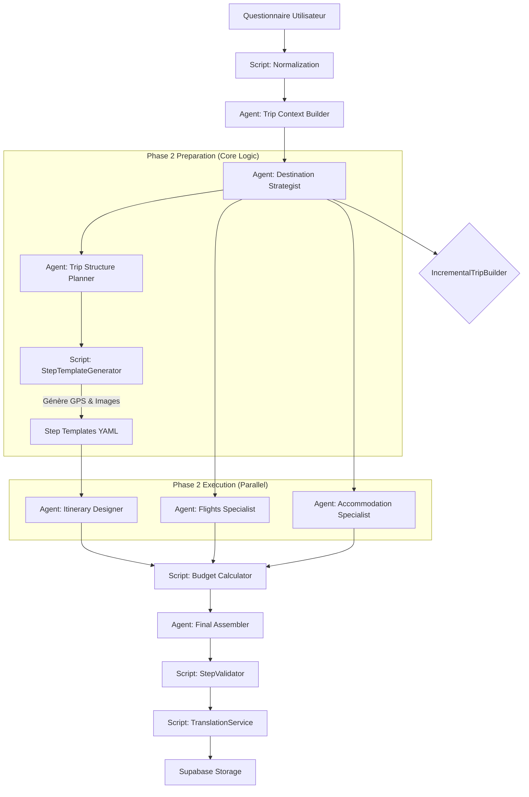

# Analyse Détaillée de la Pipeline Travliaq-Agents

**Date de l'analyse :** 11 Décembre 2025
**Version de la pipeline analysée :** v2.0 (Hybride Scripts + Agents)

## 1. Vue d'Ensemble de l'Architecture

La pipeline `Travliaq-Agents` est un système hybride sophistiqué qui combine la **précision déterministe de scripts Python** avec la **flexibilité créative d'agents CrewAI**.

Contrairement à une approche "tout-agent", cette architecture minimise les hallucinations et optimise les coûts/performances en déléguant les calculs, la structure et la validation à du code impératif, ne laissant aux agents que les tâches nécessitant une compréhension sémantique ou une recherche complexe.

### Flux Macroscopique

1.  **Phase 0 (Scripts)** : Normalisation des entrées.
2.  **Phase 1 (Agents Séquentiels)** : Compréhension du contexte et stratégie de destination.
3.  **Phase Intermédiaire (Scripts)** : Planification structurelle et génération de templates (GPS/Images).
4.  **Phase 2 (Agents Parallèles)** : Recherche (Vols, Hôtels) et Rédaction de contenu.
5.  **Phase 3 (Script + Agent)** : Calcul budgétaire strict (Script) et Assemblage final (Agent).
6.  **Post-Processing (Scripts)** : Traduction, Validation, et Persistance.

---

## 2. Diagramme de Flux (Data Flow)

---

## 3. Analyse Détaillée des Phases

### Phase 0 : Normalisation (Script)

- **Composant** : `normalize_questionnaire()`
- **Rôle** : Nettoie les données brutes (dates floues, formats incohérents) avant même de lancer un agent.
- **Objectif** : Garantir que l'Agent 1 reçoit des données propres pour réduire le risque d'erreur d'interprétation.

### Phase 1 : Context & Strategy (Séquentiel)

Cette phase établit les fondations du voyage.

- **Agent 1 : Trip Context Builder** (`trip_context_builder`)
  - **Tâche** : Extraire ~40 points de données (budget, style, dates, voyageurs) dans un YAML strict.
  - **Particularité** : `reasoning: false`. Il agit comme un extracteur ETL intelligent, pas comme un penseur.
- **Agent 2 : Destination Strategist** (`destination_strategist`)
  - **Tâche** : Valider la destination fournie (GPS, Pays) OU en suggérer 3 et choisir la meilleure. Génère le `CODE VOYAGE` (ex: `TOKYO-CULTURE-2025`).
  - **Outils** : MCP `geo.text_to_place`, `places.overview`.

### Phase Intermédiaire : Structure & Templates (Hybride)

C'est le "cerveau" structurel de la pipeline.

- **Agent 5 : Trip Structure Planner** (`trip_structure_planner`)
  - **Rôle** : Architecte. Décide du rythme (steps/jour), des zones à couvrir par jour, et du mix d'activités (ex: 60% culture, 40% nature).
  - **Output** : Un plan abstrait, sans contenu détaillé.
- **Script : StepTemplateGenerator**
  - **Rôle** : Convertit le plan abstrait en templates concrets.
  - **Actions** :
    - Appelle MCP `geo.text_to_place` pour les coordonnées GPS précises de chaque zone.
    - Appelle MCP `images.background` pour pré-générer les images.
  - **Avantage** : Les agents de rédaction (Phase 2) reçoivent des steps pré-remplies avec GPS et Images valides. Ils n'ont plus qu'à écrire le texte.

### Phase 2 : Recherche & Design (Parallèle)

Exécution de 3 crews en parallèle via `ThreadPoolExecutor` pour la rapidité.

- **Agent 3 : Flights Specialist** (`flights_specialist`)
  - **Tâche** : Recherche de vols réels via MCP `flights.prices`.
- **Agent 4 : Accommodation Specialist** (`accommodation_specialist`)
  - **Tâche** : Recherche d'hôtels via MCP `booking.search`.
- **Agent 6 : Itinerary Designer** (`itinerary_designer`)
  - **Tâche** : Rédaction pure. Reçoit les templates et remplit les champs textuels (titre FR, description, tips).
  - **Contrainte** : Interdiction de modifier GPS ou Images (déjà validés par script).

### Phase 3 : Budget & Assemblage

- **Script : Budget Calculator** (`calculate_trip_budget`)
  - **Rôle** : Calcul mathématique exact du total (Vols + Hôtels + Activités). Remplace l'agent `budget_calculator` pour éviter les erreurs d'arithmétique LLM.
- **Agent 8 : Final Assembler** (`final_assembler`)
  - **Tâche** : Consolidation finale. Il prend tous les morceaux (JSON bouts) et les assemble en un objet `Trip` complet respectant le schéma.
  - **Validation** : Vérifie la présence des champs critiques (code, total_days).

---

## 4. Analyse des Agents (Configuration Actuelle)

| Agent                  | Rôle        | Mode           | Outils Clés     | Responsabilité Majeure              |
| :--------------------- | :---------- | :------------- | :-------------- | :---------------------------------- |
| **Context Builder**    | ETL Données | No-Reasoning   | Aucun           | Extraction stricte du questionnaire |
| **Strategist**         | Décision    | Reasoning      | `geo`, `places` | Choix et validation destination     |
| **Structure Planner**  | Architecte  | Reasoning      | Aucun           | Rythme et Zones géographiques       |
| **Flights Specialist** | Chercheur   | No-Reasoning\* | `flights`       | Devis aérien précis (MCP)           |
| **Hotel Specialist**   | Chercheur   | No-Reasoning\* | `booking`       | Sélection hébergement (MCP)         |
| **Itinerary Designer** | Rédacteur   | Reasoning      | Aucun\*\*       | Contenu éditorial riche (FR)        |
| **Final Assembler**    | Intégrateur | No-Reasoning   | Aucun           | JSON final valide                   |

_\*Optimisation : Recherche directe sans boucle de raisonnement complexe._
_\*\*N'utilise pas d'outils car les templates fournissent déjà GPS/Images._

---

## 5. Mécanismes de Sécurité & Robustesse

1.  **IncrementalTripBuilder** : Un objet Python persistant qui "accumule" les résultats à chaque étape. Même si l'agent final échoue, les données partielles sont sécurisées dans ce builder.
2.  **Validation GPS/Images par Script** : En générant les templates par script, on élimine 90% des hallucinations de lieux (GPS inventé) et d'images (URLs cassées).
3.  **Calcul Budget Déterministe** : Les LLMs sont mauvais en mathématiques. Le script `calculate_trip_budget` garantit que `Total = Somme(Parties)` à l'euro près.
4.  **Fallback Traduction** : Si l'Itinerary Designer écrit en anglais par erreur, le `TranslationService` repasse derrière pour garantir le FR/EN.
5.  **Validation Schema** : Le `StepValidator` vérifie chaque step et corrige automatiquement les erreurs courantes (ex: titre manquant) avant l'insertion DB.

## 6. Points d'Attention / Optimisations Futures

- **Goulot d'étranglement MCP** : La Phase 2 lance plusieurs agents en parallèle qui bombardent le serveur MCP. Cela cause les erreurs de timeout/connexion observées (voir rapport `implementation_plan.md`).
- **Dépendance Templates** : Si le script de templates échoue (ex: API GPS down), l'Itinerary Designer doit "improviser", ce qui augmente le risque d'hallucination.
- **Complexité Assemblage** : L'Agent Final a une charge cognitive élevée (assembler des centaines de lignes de JSON). C'est le point de défaillance le plus probable pour la validité du format.
