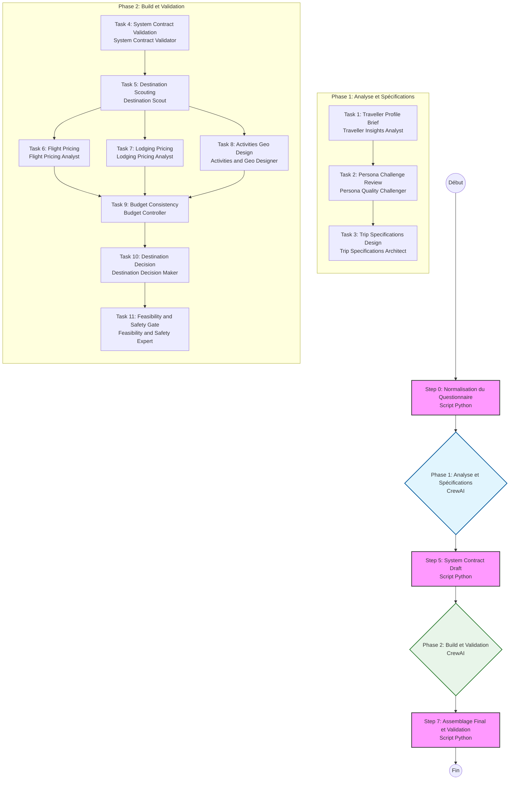

# Documentation de la Pipeline Travliaq-Agents

Cette documentation décrit le fonctionnement détaillé de la pipeline hybride (Scripts Python + Agents CrewAI) utilisée pour générer des itinéraires de voyage.

## Vue d'ensemble

La pipeline est orchestrée par la classe `CrewPipeline` dans `app/crew_pipeline/pipeline.py`. Elle combine des étapes de traitement déterministes (scripts) et des étapes de raisonnement créatif (agents).

### Diagramme de Flux

## Détail des Étapes

### Étape 0 : Normalisation (Script)

**Responsable :** `normalize_questionnaire` (Script Python)

- **Objectif :** Nettoyer et standardiser les données brutes du questionnaire utilisateur.
- **Action :** Vérifie les champs obligatoires, formate les dates, et structure les données pour les étapes suivantes.
- **Sortie :** `normalized_questionnaire` (Dict)

---

### Phase 1 : Analyse & Spécifications (CrewAI)

Cette phase vise à comprendre le voyageur et à définir précisément sa demande avant de chercher des solutions.

#### Task 1 : Traveller Profile Brief

- **Agent :** `Traveller Insights Analyst`
- **Rôle :** Analyser le questionnaire et l'inférence persona pour identifier les besoins explicites et implicites.
- **Action :** Produit une analyse narrative et structurée (points forts, points de vigilance, besoins critiques).
- **Sortie :** `persona_analysis` (YAML)

#### Task 2 : Persona Challenge Review

- **Agent :** `Persona Quality Challenger`
- **Rôle :** Critiquer et valider l'analyse du profil voyageur.
- **Action :** Utilise les outils MCP pour vérifier la faisabilité initiale (budget, saison) et détecter les biais.
- **Sortie :** `challenge_report` (YAML)

#### Task 3 : Trip Specifications Design

- **Agent :** `Trip Specifications Architect`
- **Rôle :** Traduire l'analyse en spécifications techniques pour le moteur de recherche.
- **Action :** Fusionne les faits du questionnaire avec l'analyse validée pour produire une demande normalisée stricte.
- **Sortie :** `normalized_trip_request` (YAML)

---

### Étape 5 : System Contract Draft (Script)

**Responsable :** `build_system_contract` (Script Python)

- **Objectif :** Générer une ébauche de contrat système.
- **Action :** Crée une structure de données complexe (`System Contract`) qui servira de colonne vertébrale pour la construction du voyage, en pré-remplissant les champs calculables.
- **Sortie :** `system_contract_draft` (YAML)

---

### Phase 2 : Build & Validation (CrewAI)

Cette phase construit concrètement le voyage en cherchant et validant chaque composant (vols, hôtels, activités).

#### Task 4 : System Contract Validation

- **Agent :** `System Contract Validator`
- **Rôle :** Valider et enrichir l'ébauche du contrat système.
- **Action :** Vérifie la cohérence des dates et budgets, et complète les préférences qualitatives manquantes.
- **Sortie :** `system_contract` (YAML validé)

#### Task 5 : Destination Scouting

- **Agent :** `Destination Scout`
- **Rôle :** Proposer des destinations candidates.
- **Action :** Cherche 4-5 options de destinations compatibles avec le profil, le budget et la saison, en évaluant les risques.
- **Sortie :** `destination_slate` (YAML)

#### Task 6 : Flight Pricing

- **Agent :** `Flight Pricing Analyst`
- **Rôle :** Estimer les coûts de transport.
- **Action :** Recherche les vols pour les destinations proposées (prix, durée, escales) via MCP.
- **Sortie :** `flight_quotes` (YAML)

#### Task 7 : Lodging Pricing

- **Agent :** `Lodging Pricing Analyst`
- **Rôle :** Estimer les coûts d'hébergement.
- **Action :** Identifie des options d'hôtels représentatives pour valider la faisabilité budgétaire.
- **Sortie :** `lodging_quotes` (YAML)

#### Task 8 : Activities Geo Design

- **Agent :** `Activities & Geo Designer`
- **Rôle :** Concevoir l'expérience sur place.
- **Action :** Crée un itinéraire jour par jour avec des activités géolocalisées (1-3 par jour).
- **Sortie :** `activities_plan` (YAML)

#### Task 9 : Budget Consistency

- **Agent :** `Budget & Consistency Controller`
- **Rôle :** Garantir la cohérence financière.
- **Action :** Consolide les coûts (Vols + Hôtels + Activités) et vérifie l'alignement avec le budget total. Propose des arbitrages si nécessaire.
- **Sortie :** `budget_alignment_report` (YAML)

#### Task 10 : Destination Decision

- **Agent :** `Destination Decision Maker`
- **Rôle :** Choisir la meilleure option finale.
- **Action :** Sélectionne la destination gagnante, fixe le budget final et prépare les statistiques récapitulatives.
- **Sortie :** `final_destination_choice` (YAML)

#### Task 11 : Feasibility & Safety Gate

- **Agent :** `Feasibility & Safety Expert`
- **Rôle :** Validation finale de sécurité.
- **Action :** Vérifie une dernière fois les visas, la météo et les alertes de sécurité. Bloque le processus en cas de risque critique.
- **Sortie :** `feasibility_gate` (YAML)

---

### Étape 7 : Assemblage Final & Validation (Script)

**Responsable :** `assemble_trip` & `validate_trip_schema` (Scripts Python)

- **Objectif :** Produire le JSON final.
- **Action :**
  1.  Combine tous les outputs des agents et du contrat système.
  2.  Valide le résultat contre le schéma JSON strict (`trip_schema.json`).
  3.  Sauvegarde le résultat (si configuré, ex: Supabase).
- **Sortie :** JSON Final du voyage.
