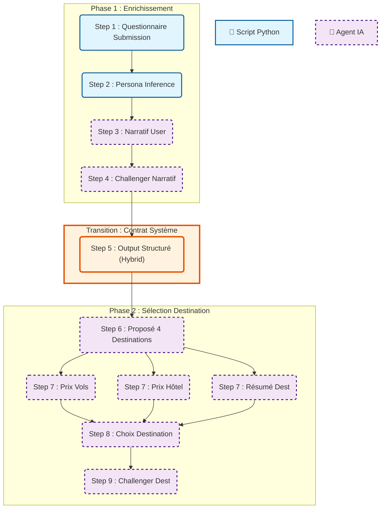

# Workflow de Génération de Voyage (Trip Generation)

Ce document est la **source de vérité** du pipeline de génération de voyages Travliaq. Il décrit l'architecture complète en deux phases, distinguant les processus déterministes (Scripts) des processus génératifs (Agents IA).

---

## 🏗️ Architecture Globale

Le pipeline est divisé en deux phases distinctes.

### Légende

- 🐍 **Script Python** : Exécution de code déterministe, logique impérative.
- 🤖 **Agent IA** : Raisonnement LLM, utilisation d'outils, logique probabiliste.

---

## Phase 1 : Enrichissement et Catégorisation Utilisateur

Cette phase transforme les données brutes du questionnaire en un profil voyageur structuré et validé.

### 1. 🐍 Questionnaire Submission (Script)

- **Type** : Point d'entrée Python.
- **Action** : Réception du payload JSON depuis l'API/Supabase.
- **Rôle** : Validation technique initiale des données entrantes.

### 2. 🐍 Persona Inference (Script)

- **Type** : Service Python Déterministe (`PersonaInferenceService`).
- **Action** : Calcul algorithmique du "score" persona basé sur les réponses (ex: 60% Nature, 40% Luxe).
- **Output** : Contexte structuré injecté dans le prompt des agents.

### 3. 🤖 Narratif User (Agent : Traveller Insights Analyst)

- **Type** : Agent IA (CrewAI).
- **Action** : Analyse psychologique et rédactionnelle.
- **Outil MCP** : `read_les_macro_personas...` (Consultation obligatoire).
- **Output** : "Traveller Profile Brief" (Narratif immersif + Analyse des besoins).

### 4. 🤖 Challenger Narratif (Agent : Persona Quality Challenger)

- **Type** : Agent IA (CrewAI).
- **Action** : Fact-checking et critique constructive.
- **Outil MCP** : `read_guide_tourisme...` (Vérification faisabilité budget/saison).
- **Output** : "Persona Challenge Review" (Validation des hypothèses).

### 5. 🔄 Contrat Système (Hybrid : Script + Agent)

- **Type** : Hybride (Calcul Déterministe + Complétion IA).
- **Rôle** : Pivot de transition pour garantir la fiabilité des données chiffrées.
- **Action** :
  1.  **🐍 Script** : Calcule toutes les données objectives (dates, durées, fourchettes budgétaires) pour éviter toute hallucination.
  2.  **Validation** : Vérifie la complétude du fichier.
  3.  **🤖 Agent** : Intervient uniquement si nécessaire pour compléter les informations qualitatives ou contextuelles manquantes.
- **Output** : `normalized_trip_request.yaml` (Contrat immuable).

---

## Phase 2 : Sélection de la Destination (Target Architecture)

Cette phase utilise le profil validé pour sélectionner et affiner la destination idéale.

### 6. 🤖 Proposé 4 Destinations (Agent : Destination Scout)

- **Type** : Agent IA.
- **Input** : `normalized_trip_request.yaml`.
- **Action** : Recherche large et proposition de 4 options viables.

### 7. 🤖 Enrichissement Data (Agents Spécialisés)

- **Résumé Destination** : Génération de descriptions attractives.
- **Prix Moyen Vols** : Consultation API (Skyscanner/Amadeus via MCP).
- **Prix Moyen Hôtel** : Consultation API (Booking/Expedia via MCP).

### 8. 🤖 Choix de la Destination (Agent : Decision Maker)

- **Type** : Agent IA.
- **Action** : Sélection de la meilleure option basée sur le rapport Qualité/Prix/Expérience.

### 9. 🤖 Challenger Destination (Agent : Feasibility Expert)

- **Type** : Agent IA.
- **Action** : Validation finale (Sécurité, Visas, Santé).
- **Output Final** : Itinéraire macro validé.

---

## Diagramme de Flux (Mermaid)

---

## 🔍 Détail du Flux d'Exécution (Step-by-Step)

Voici ce qui se passe techniquement à chaque étape :

1.  **L'utilisateur soumet son questionnaire** : Les données (dates, budget, envies) arrivent au système.
2.  **Le Script Python analyse les réponses** : Il calcule mathématiquement un profil (ex: "Aventurier à 80%"). C'est instantané et fiable.
3.  **L'Agent Analyste (IA) lit tout** : Il prend le questionnaire et le profil calculé. Il va lire la base de connaissance (MCP) pour comprendre ce que signifie "Aventurier" et écrit une histoire sur ce voyageur.
4.  **L'Agent Challenger (IA) critique** : Il relit l'histoire et vérifie si c'est réaliste. Si le voyageur veut aller en Islande en hiver avec un petit budget, l'agent va chercher dans le guide touristique (MCP) et dire "Attention, c'est cher et il fait nuit".
5.  **Le Contrat Système (Hybride)** : D'abord, un **Script Python** calcule toutes les données objectives (dates, budget) pour éviter les erreurs de calcul de l'IA. Ensuite, l'IA intervient uniquement pour compléter les "trous" qualitatifs. C'est la garantie anti-hallucination.
6.  **L'Agent Scout (IA - Phase 2)** : Il utilise ce fichier propre pour chercher 4 destinations qui correspondent parfaitement.
7.  **Les Agents Data (IA - Phase 2)** : Ils vont chercher les prix réels (vols, hôtels) pour chaque destination proposée.
8.  **L'Agent Décideur (IA - Phase 2)** : Il compare tout et choisit la meilleure destination.
9.  **L'Agent Final (IA - Phase 2)** : Il valide que tout est sûr et faisable avant de présenter le voyage au client.
