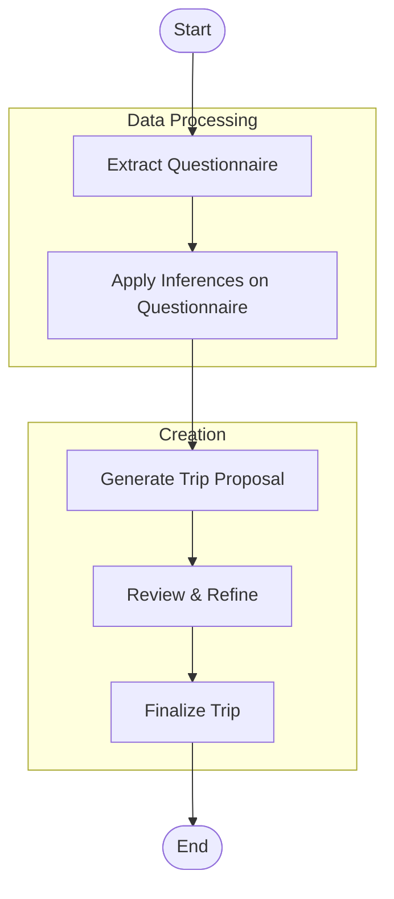

# Trip Generation Workflow

This document models the workflow for generating a trip in Traviaq Agents.

```mermaid
flowchart TD
    Start([Start]) --> Extract[Extract Questionnaire]
    Extract --> Infer[Apply Inferences on Questionnaire]
    Infer --> Generate[Generate Trip Proposal]
    Generate --> Review[Review & Refine]
    Review --> Finalize[Finalize Trip]
    Finalize --> End([End])

    subgraph "Data Processing"
    Extract
    Infer
    end

    subgraph "Creation"
    Generate
    Review
    Finalize
    end
```
